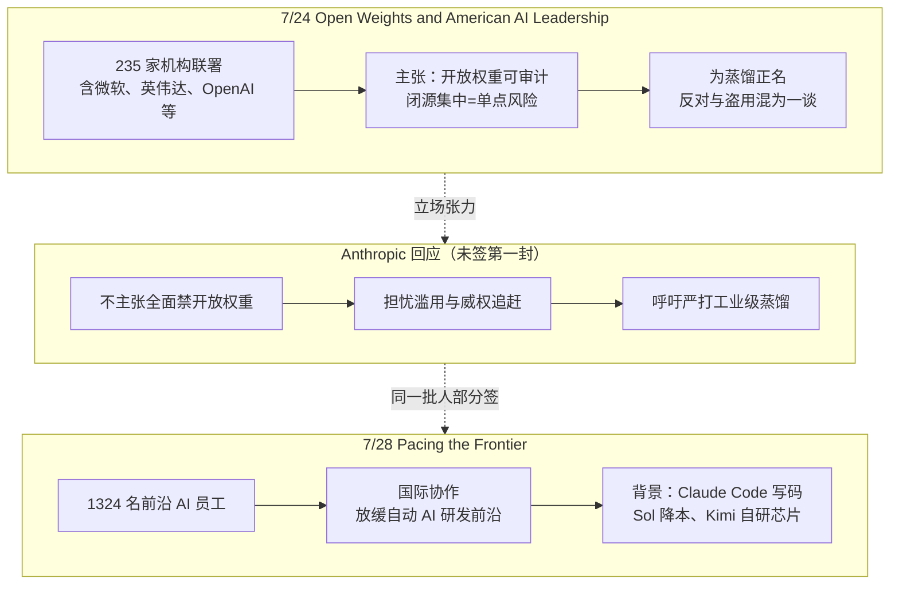

### 结论

2026 年 7 月下旬，AI 行业用两封公开信把「开放权重 vs 闭源」和「自动化 AI 研发要不要踩刹车」摆上台面。微软牵头、235 家机构签署的 **Open Weights and American AI Leadership** 主张：单靠闭源并不更安全，开放权重能让社区审计与加固；并明确为 **蒸馏（distillation）** 正名。Anthropic 未署名，三天后 CEO Dario Amodei 重申开放权重风险，同时呼吁打击「工业级蒸馏」。7 月 28 日，**Pacing the Frontier** 又获 1324 名前沿公司员工联署，要求各国合作建立技术与管理工具，**刻意放缓自动化 AI 研发的前沿推进**。对工程师而言：本地/开源权重、蒸馏管线、以及 AI 写代码提速，都可能很快撞上合规与供应链变数。

### 要点

- **闭源不等于更安全，集中才是单点故障。** 第一封信的核心论点是：闭源模型可被攻破、滥用或静默失效，外人难以察觉；把先进能力锁在少数闭源手里，会放大单点风险、削弱竞争。开放权重则让更多研究者检查行为、找漏洞、补护栏—— 这是在回应美国政界因「安全」限制开放权重的倾向（Claude Fable 5 事件后讨论更热）。

- **蒸馏从「灰色技巧」变成公开政策议题。** 信中要求决策者别把正当的模型开发技术与「盗用」混为一谈：**用 A 模型输出训练或改进 B 模型** 是业界常用的评估、验证与迭代手段，类似开源软件「站在前人肩膀上」。Anthropic 立场相反：Amodei 呼吁 **严打工业级蒸馏运营**，担心敌对势力用蒸馏追平美国前沿能力—— 若立法收紧，很多低成本复现、微调、评测流程都要重审数据来源。

- **Anthropic 没签第一封，但不是「反开放权重」。** 官方回应强调从未主张 **全面禁止** 开放权重，担忧的是威权政府造出更强模型，以及开放权重被用于网络攻击、生物攻击等滥用。两条路线表面都谈安全，抓手不同：一方推开放生态 + 合法蒸馏，一方推风险管控 + 限制大规模蒸馏。

- **第二封信谈的是「自动化研发」带来的竞赛失控。** **Pacing the Frontier** 署名者包括 OpenAI 首席科学家 Jakub Pachocki、SSI 的 Ilya Sutskever、Anthropic 的 Amodei 与 Jack Clark 等 1324 人。他们担心：在 **AI 自动做 AI 研究** 加速的背景下，各国/各公司被迫抢跑。例证已不抽象—— Anthropic 约 **80% 代码由 Claude Code 生成**，OpenAI 用 Sol 把端到端服务成本降约 **20%**，Kimi K3 甚至自研芯片服务自家 nano 模型。能力涨得越快，越需要国际层面的「 pacing 工具」。

- **读信要看签名缺席与利益结构。** 第一封缺 Anthropic，第二封却有多家前沿员工同框—— 说明「开放权重」与「前沿节奏」是不同维度的博弈。选模型、定架构时，别只盯 benchmark：权重是否可本地部署、训练数据是否涉及蒸馏链、供应商在美欧监管叙事里站哪边，都会变成工程约束。

### 怎么做

1. **把公开信当需求雷达，不是新闻摘要。** 记下三句话即可：开放权重阵营在争 **部署自由与审计权**；Anthropic 在争 **滥用与蒸馏边界**；前沿员工在争 **自动研发提速下的国际协调**。它们直接影响开源权重发布节奏、API 条款和出口管制传闻。

2. **盘点自己栈里的「开放权重 + 蒸馏」暴露面。** 列出：是否下载 Hugging Face 权重本地跑、是否用强模型输出做 SFT/DPO/评测、是否把闭源 API 响应当训练集。若政策收紧蒸馏，优先准备 **可证明的数据 lineage**（哪些样本来自自有数据、哪些仅作评测）。

3. **闭源单点要有 Plan B。** 第一封信说的「少数闭源单点故障」对业务也成立：关键路径是否绑死一家 API？能否用开放权重模型做降级、离线或合规分区？不必立刻迁移，但要能回答「供应商政策变脸时 48 小时内怎么办」。

4. **把「AI 写代码」纳入风险登记册。** Pacing the Frontier 的焦虑来自自动化研发已落地。团队若大量使用 Copilot、Claude Code、Cursor 等，应在发布流程里保留 **人类审查 diff、测试与权限边界**—— 这既防质量事故，也在监管讨论里证明你们不是无脑加速。

5. **关注签名公司的产品路线图。** 署名名单（NVIDIA、Amazon、YC、Linux Foundation、OpenAI 等）往往预示接下来半年生态投入方向：推理芯片、云托管开源权重、基金会治理工具。跟进这些主体的博客与许可证变更，比逐字读信更省时间。

### 关键图表

*三封信构成 2026 夏的政策三角：开放生态、蒸馏边界、自动研发节奏—— 工程选型需同时看见三条线*
