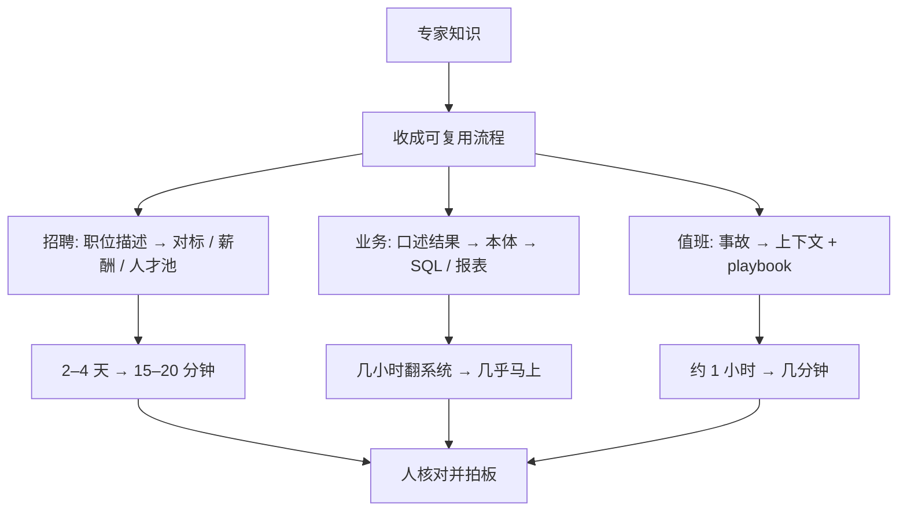

### 结论

OpenAI 这篇客户故事写的是 **Oracle** 自己怎么用 **ChatGPT Work**（面向工作的 Agent，能把多步任务做完，而不只是聊天）和 **Codex**（写代码、查系统、跟任务的编码 Agent），不是再发一篇「企业都该上 AI」的口号。超过十万名员工已经在用：招聘、Oracle Applications Lab（管公司核心业务流程的内部团队）、IT 都在其中。官方给出的活跃数是 **13 万** ChatGPT 用户、**9.5 万+** Codex 用户。每一处的共同点是：以前靠少数专家、要花几天的活，现在谁都能跑，而且在几分钟内做完。招聘侧的人才获取研究耗时他们写下降了 **98%**——编材料从 **2–4 天**变成准备 **15–20 分钟**；业务用户改成描述想要的结果，不再自己翻报表；简单线上事故从大约一小时压到几分钟。Applications Lab 集团副总裁 **Richard Lam** 的判断：这是业务在变，不是多开了一个聊天窗口。

### 要点

- **招聘先造可复用的「人才市场情报」工具，而不是每次让招聘自己搜。** 全球人才获取负责人 **Jan Ackerman** 用 ChatGPT Work 做了一套工具：丢进职位描述，它去对标同类岗位、做薪酬基准、评估相关地区的人才池。以前这些材料要编 **2–4 天**，才能拿去跟用人经理开会；现在准备大约 **15–20 分钟**。Ackerman 的原话是「从零到一百」。更快之外，流程也齐了：以前每个招聘的 intake（和用人经理对齐需求）做法不同，现在每位用人经理拿到的数据质量一样，不取决于碰上哪位招聘。

- **业务用户口述结果，前提是先有一张公司对象地图。** Applications Lab 先建了公司对象、关系和规则的 **ontology（本体）**——把「系统里有什么、怎么连、什么规则」编成机器能查的地图。有了这张图，口语问题才能被 Codex 收成可靠的 **SQL**（查数据库的语言）。用户描述想要的结果，Codex 决定调哪些内部系统、把信息凑齐，再交分析、报表或一个小应用。一位同事问了一个以前要花几小时的问题，几乎马上拿到答案；她用旧的手工流程对了一遍，数字完全对得上。这是一条核对过的例子，不是全场准确率测试。

- **SRE 用 Codex 找上下文和手册，人还是做决定。** 生产工程里，**SRE**（站点可靠性工程师，负责线上别挂）让 Codex 收集事故相关上下文，并自动翻出对的 **playbook**（事故处理手册）。人把时间花在拍板上，而不是满仓库找资料。Lam 说，典型的简单事故以前要一小时，现在几分钟能处理。他也写清楚：这些都不在自动驾驶上跑，底下的系统还是人要建对。

- **护栏、原型、代码所有权，三条都不能省。** Lam：系统设计、架构、安全、以及希望 Codex 怎么组织代码，都还要人定。IT 组织 CIO 技术顾问、副总裁 **Barry Shilmover**：以前把想法写在纸上，现在直接做成原型。Lam 还有一句更硬的：如果你不和 Codex 并肩改，最后会留下大量没法维护的代码。

- **下一题仍然先问 Codex，但答案还是人的。** 招聘、分析、工程都在描述结果，让 Codex 和 ChatGPT 去想怎么做。Shilmover 的用法是：他不知道下一个问题是什么，但知道第一件事会是把 Codex 拉进来。

### 怎么做

面向正在给招聘、内部报表或值班上 AI 的 junior：不必复制 Oracle 的本体名字，按同一组问题挡一遍。

1. **先把专家活收成可复用工具。** 招聘调研、薪酬对标这类每次都要做、以前靠少数人的，写成「输入职位描述 → 输出同一套材料」。不要每次新开一个空白聊天。

2. **想让业务用户口述，先画对象、关系和规则。** 没有本体，Codex 只能猜该查哪张表。先写清系统里有什么对象、怎么连、什么不能自动改。

3. **值班：Agent 找手册，人拍板。** 简单事故可以让 Agent 拉上下文和 playbook；升级、改生产、对外沟通仍由人做。量的是「几分钟结案」，不是「无人值守」。

4. **护栏写进系统设计，不要事后补。** 架构、安全、代码结构，开工前告诉 Codex。读数据和改数据分开。

5. **用原型对齐，不要只丢一页规格；生成的代码你要能讲。** 想法先做成能点的原型。和 Agent 一起改，直到你能讲清改了哪条路径。讲不清就不当作已交付。

### 关键图表

*OpenAI 原文的三条线：招聘、报表、值班都是先把专家活收成流程，再压缩时间；人仍负责核对和拍板*
