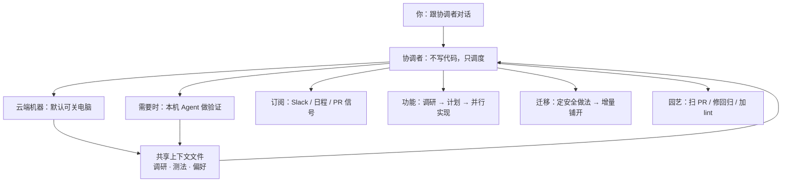

### 结论

Cursor 在 9 月 10 日上线 **Projects（项目）**：面向「一个功能、一次迁移、甚至一整款应用」这种会跨很多轮对话的活。你只跟 **协调者（coordinator）** 聊天——它自己不写代码，而是指挥别的 Agent 去写、去测；上下文能存几个月，还可以按 Slack、定时任务或 PR 信号自己动手。文章把这当成他们二月份说的「第三代开发」落地：**开发者从「管一堆 Agent」换成「指挥整块工作」。** 内部用了几个月：新用户合并 PR 多约 30%，**主要用 Projects 的人合并量约 6 倍。**

### 要点

- **协调者只调度，所以不会被写代码卡住。** 你监督一个 Project，就是跟它的 coordinator 对话。它把任务派给真正写代码的 Agent（还可以同时派很多个 **subagent**，即子代理）。因为它委托而不是亲自执行，所以不会「正在写文件所以没法理你」——你随时能改方向。

- **默认在云端自己的电脑上跑，关笔记本也不停。** Project 有独立机器，并行的子代理可以比笔记本撑得住的更多。只有「必须在你本机测」时，协调者才会再拉一个 **本地 Agent** 去跑。这和「开一个聊天窗口、关了就断」不是同一层。

- **共享上下文 = 不用每次重新培训 Agent。** 每个 Project 维护一组文件，在它用到的云端和本地机器之间同步。Agent 会把调研、产物、仓库怎么测、你希望怎么干活写进去。例如有人搞清楚某个服务怎么测，以后的 Agent 直接用这份说明。上下文跟着 Project 变厚，协调者会越来越懂这块活。

- **订阅：不用你每次开口。** 协调者可以盯一个 Slack 频道、按日程跑、或跟踪你的全部 PR：修 CI、在 PR 打开或合并时采取行动。信号来了就干，而不是等你再 @ 一次。

- **三种用法覆盖他们内部大多数场景。** **功能开发**：先调研写进共享上下文 → 协调者出计划 → 并行实现和测试；要试用时再在你电脑上起本地 Agent；上线后同一 Project 还能拿着当初的决策上下文去看日志、接 bug。**迁移**：容易开头、很难收尾（他们用来换框架、换样式系统，跨几百个 PR）；先和协调者定安全做法，再增量铺开——前期每条 PR 细看，稳住了就少看，让它自己扫完。**园艺（gardening）**：质量、回归这种永远做不完的活。有位工程师用设计系统 Project：一开始每条修复都 Review；现在协调者扫新 PR、抽出该进设计系统的组件，**同一错误出现两次就加一条 lint 规则**。这个 Project 预计每天碰到 20～100 个 PR，人只在需要注意力的地方介入。

### 怎么做

面向已经会用 Cursor Agent、但还在「一个聊天窗口干一件小事」的工程师：

1. **从左侧导航新建 Project，用一句话描述要建成什么。** 文章说 beta 已开始向所有用户推开。适合「活得比单次聊天更久」的工作：跨多个 PR 的功能、迁移、或你不在时也希望有人接着盯的事。不要用它替代「改一个 typo」这种短任务。

2. **先让 Agent 调研并写入共享上下文，再让协调者拆并行任务。** 功能开发的顺序在原文里写得很清楚：研究系统 → 记下来 → 出计划 → 不同部分并行实现和测试。你缺的往往不是更多窗口，而是**下一轮 Agent 还能读到的说明**（怎么测、架构偏好、禁止事项）。

3. **迁移类：先锁「安全做法」，再放手增量。** 和协调者对齐：一次改多大、怎么验证、失败怎么回滚。早期每条 PR 认真看；修复站得住之后再降低 Review 密度，让协调者继续铺。这是「好开头、难收尾」类工作的用法，不是一上来全仓库自动合并。

4. **把重复劳动交给订阅，而不是每天重新开聊。** 需要盯 Slack 报 bug、跟全部 PR、修 CI、或按日程巡检时，用订阅而不是闹钟提醒自己去 Prompt。设计系统那个例子的可迁移动作是：**同一类错出现两次 → 写成 lint**，让园艺从「人盯 diff」变成「规则替你盯」。

5. **必须本机才能验的步骤，明确让协调者派本地 Agent。** 云端默认跑、关电脑不停；但点击界面、连本机服务、看真实设备，仍要落到你的机器。提示里写清「这部分在本地跑」，避免整段工作卡在「云上过了、你笔记本上没人点」。

6. **上线后不要另开一个失忆的聊天。** 原文的功能模式是：同一 Project 带着当初为什么这么做的上下文，去监控日志和处理 bug。新缺陷优先丢回这个 Project，而不是从零再讲一遍背景。

### 关键图表

*Projects 的一层抽象：你指挥工作，协调者指挥 Agent；上下文和订阅让它跨月、不必每次重新开口*
