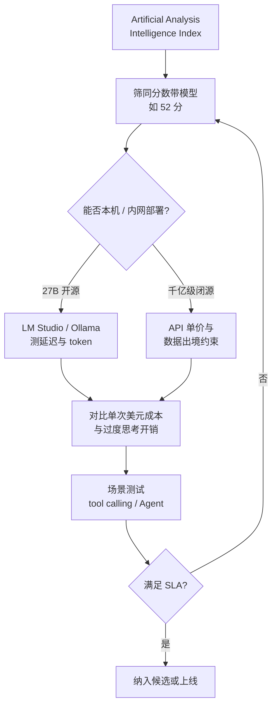

### 结论

Qwen 3.8 27B 在 **Artificial Analysis Intelligence Index** 上拿到 **52 分**，与 GPT-5.6 Luna (max) 持平，只比 GLM-5.2 (max) 和 DeepSeek V4 Pro 0813 (max) 低 **1 分**。后两者参数量分别是 **753B** 和 **1.6T** 量级，Luna 虽未公开体量，也远大于 27B。对工程团队的意义很直接：**榜单头部能力不再只属于巨型闭源 API**；若你的场景能容忍 27B 的上下文与速度，本地或廉价托管推理的性价比会突然变得值得认真算一笔账。

### 要点

- **Artificial Analysis Intelligence Index 是什么。** 第三方机构 Artificial Analysis 汇总的综合智力指数，把多类 benchmark（推理、知识、代码等）打成单一分数，方便横向比模型。它不是「唯一真理」，但能快速筛出「同一分数带里有哪些候选」，避免只看厂商宣传稿。

- **参数量 ≠ 榜单分数，但参数量决定你怎么部署。** 52 分说明「做题能力」挤进第一梯队；753B / 1.6T 意味着你只能走云端 API 或昂贵集群。27B 在 M 系列 Mac、消费级 GPU 或 LM Studio 里就能跑——Simon 此前用同一模型测过本地 CORS Chat，说明链路已通。

- **同分不同价：闭源 max 档 vs 开源权重。** Luna (max) 与 Qwen 3.8 27B 同分，但前者通常是按 token 计费的闭源服务，后者权重可下载、可自建。做 Agent 或批处理时，**单次调用成本 + 数据是否出网** 往往比榜单第几名更决定选型。

- **别忽视「过度思考」的副作用。** Simon 另文提到 Qwen 3.8 27B 默认会 **wildly overthink**——简单任务也可能吐出大量 reasoning token，延迟和账单一起涨。高分模型接入生产前，要用你自己的提示测 **延迟、输出 token 数、是否关推理档**。

- **榜单是入口，不是验收。** Intelligence Index 测的是综合 benchmark，不保证你的 **tool calling、长上下文记忆、多轮 Agent** 同样领先。高分只说明「值得进下一轮集成测试」，不能替代 `@Branch` 级别的真实 diff 场景。

### 怎么做

1. **先上 Artificial Analysis 看分数带。** 打开 [Artificial Analysis](https://artificialanalysis.ai/) 的 Intelligence Index，找到目标分数（如 52）附近的模型列表，记下参数量、是否开源、是否有 API。把「能本机跑」和「只能云端」分成两列。

2. **本机或 LM Studio 跑通最小链路。** 下载 Qwen 3.8 27B 量化权重，用 LM Studio、Ollama 或 `llm` CLI 发一条固定 hello world（例如短问答或 SVG 提示）。确认：显存/内存占用、首 token 延迟、流式输出是否正常——Simon 用 LM Studio + CORS Chat 就是在做这一步。

3. **对比同分闭源 API 的单次美元成本。** 同一提示分别在 Luna (max) 类 API 与本地 27B 上跑，记录 `prompt_tokens`、`completion_tokens`（若有 `reasoning_tokens` 一并记）。乘各自单价，算「一万次调用差多少钱」——很多内部工具会因此从 API 切到本地。

4. **压测过度思考。** 用你真实的短任务提示（写 commit message、改一行配置）各跑三遍，看输出是否冗长、是否可关 reasoning / 调 `temperature`。若默认思考过长，在 Agent 里加输出长度限制或换非 max 档。

5. **通过榜单后做场景测试。** 补跑与你产品相关的：**多轮 tool calling**、失败重试、敏感数据是否必须留内网。榜单同分模型里，选 **部署约束**（纯内网、预算、延迟）最匹配的那一个，而不是参数最大的那一个。

### 关键图表

*榜单筛分数 → 部署约束定路线 → 真实场景验收—— 别跳过中间两步*
