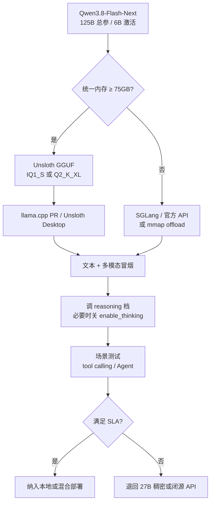

### 结论

Qwen 开源了 **Qwen3.8-Flash-Next**：多模态 **MoE**（Mixture of Experts，混合专家）模型，也是 **Qwen4 架构的早期预览**。总参数量 **125B**，但每 token 只激活约 **6B**，推理成本接近小模型、能力却对标更大体量。Simon Willison 已在 **DGX Spark** 上用 Unsloth 的 **1–2 bit 量化权重**跑通，并生成多模态样例。对工程团队的意义：**不必等闭源 API**——若你有 75GB+ 统一内存或能 offload N-gram 嵌入层，可以本机试这台「Flash」档的 Agent / 多模态原型。

### 要点

- **MoE + 小激活 = 大模型能力、小模型账单。** MoE 把计算分给多个「专家」子网络，每次只路由其中几个。125B 总参数里仅 **6B 激活**，另有 **51B N-gram Embedding**（用二元/三元组索引做查表式嵌入，算力比 MoE 更省、也更适合 offload 到内存/SSD）。别被「125B」吓到——看 **activated params** 和量化后显存，才是你机器能不能跑的标准。

- **它是 Qwen4 的「先行版」，不是最终形态。** 角色类似当年的 Qwen3-Next 之于 Qwen3.5：架构含 **Gated DeltaNet + 稀疏注意力 + 512 专家（top-10 路由）**，原生 **262K 上下文**（可扩到 1M）。想押注下一代 Qwen 栈的，现在就能用开源权重摸清 tool calling、多模态和推理档行为。

- **多模态：带视觉编码器。** 不止文本——Simon 用量化版生成了 **鹈鹕（pelican）** 等图像样例。做「本地看图说话」或图文 Agent 时，这是少数能在消费级/工作站统一内存上试的 **开源多模态 MoE** 之一。

- **Unsloth 量化把门槛压到 ~75GB 内存。** 官方 BF16 约 **355GB**；Unsloth **UD-IQ1_S（约 72.5GB）**、**UD-Q2_K_XL（约 78.9GB）** 可在 **DGX Spark** 这类大统一内存设备上跑。1-bit 版因 N-gram 层不易极致压缩，体积仍大，但精度保留更好——Simon 反馈 **xhigh reasoning effort** 的 Q2 档效果最好。

- **和 Qwen 3.8 27B 是不同路线。** 27B 是稠密小模型、易在 Mac 上跑；Flash-Next 走 **大总参 + 小激活 + 多模态**，更吃内存与专用推理栈（SGLang day-0、llama.cpp 特定 PR、Unsloth Desktop）。选型时先问：你要 **便携本机** 还是 **单机顶配榨 Agent 能力**。

- **默认可能「过度思考」。** 同系列 27B 已有默认 reasoning 过长的问题；Flash-Next 支持 **xhigh** 等推理档。接入前用固定短提示测 **延迟、completion token 数**，必要时在 API 里设 `enable_thinking: false`（或等价 chat template 参数）关思考模式。

### 怎么做

1. **确认硬件再下载。** 查 Unsloth GGUF 表：1-bit 约 **75GB** 总内存（RAM + 统一内存），2-bit 约 79GB。不够则考虑 **mmap offload N-gram/PLE 到 SSD**，或走云端 SGLang / 官方 API（模型名 `Qwen/Qwen3.8-Flash-Next`）。

2. **选 Unsloth 量化档试跑。** 从 Hugging Face 拉 `unsloth/Qwen3.8-Flash-Next-GGUF`；Simon 路径是 **UD-IQ1_S**（更省内存）与 **UD-Q2_K_XL**（质量更好）。用 **Unsloth Desktop** 或带 [llama.cpp PR #27742](https://github.com/ggml-org/llama.cpp/pull/27742) 的构建，避免「模型太新、运行时不认架构」。

3. **发一条固定基准提示。** 文本：短问答 + 简单代码补全；多模态：一张小图 + 描述任务。记录首 token 延迟、总 token、是否流式正常——与 Simon 的 pelican 样例同类，确认视觉链路通。

4. **对比推理档与思考开关。** 同一提示分别跑默认档与 **xhigh reasoning**；再在 API `extra_body` 里设 `enable_thinking: false` 复测。把 **质量提升是否值得 2–5× token** 记下来，Agent 里常需要硬上限。

5. **通过冒烟测试后再接 Agent。** 补测与你产品相关的：**tool calling**、多轮失败重试、长上下文截断。Flash-Next 在 SWE-bench Pro 等 Agent 编码榜单上领先 27B，但不保证你的 MCP 工具 schema 一次就对——榜单是入场券，不是验收单。

### 关键图表

*大参小激活不等于大显存——先算量化后内存，再调推理档，最后才接生产 Agent*
