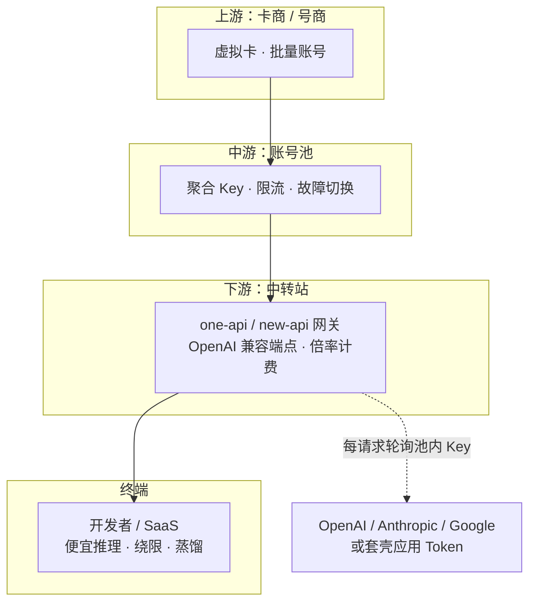

### 结论

中国已形成一套成熟的 **LLM Token 中转灰市**：卡商批量注册账号、账号池聚合密钥、中转站用开源网关 **one-api / new-api** 对外卖「官方价 3% 左右」的推理额度。货源靠免费试用薅羊毛、盗刷信用卡、把未设防的客服机器人当代理，甚至专门烧厂商预算。Simon Willison 据此提醒：**任何对外暴露的 LLM 端点，都可能被整套产业链盯上**；厂商和自建应用都要设**硬性消费上限**，超额立刻停服，而不是事后看账单。

### 要点

- **中转站（Relay）是什么。** 对外提供一个与 OpenAI 兼容的 API 地址，买家把 SDK 的 `baseURL` 改过去即可。背后从密钥池里轮询上游 Key，按用量 × **倍率**扣费。最便宜的中转站相对官方价可打到约 **97.8% 折扣**——例如官方约 $3,333 的额度，灰市约 425 元人民币就能买到等效用量。

- **产业链分四层，职责清晰。** **卡商/号商**卖虚拟卡和批量账号；**账号池**管 Token、限流、故障切换；**中转站**做中文计费、客服群、比价；**终端买家**要便宜推理、绕过地域限制，或拿输出做 **模型蒸馏**。各层常由同一批人运营，论坛里「池」和「站」经常混称。

- **软件本身中立，滥用发生在「渠道」上。** one-api 及其活跃分支 new-api 是正经的 API 网关：企业自建时用来统一团队配额、分摊自家 Key 完全合法。越界发生在 **渠道（渠道 = 某厂商 + 一批 Key）** 里塞的是盗来的、泄露的或薅来的凭证，再转售违反厂商 ToS 的访问权。

- **货源手段多样，不限于偷 Key。** 包括：批量注册领免费额度、信用卡拒付、预付卡小额充值、把**没设消费上限的客服/支持机器人**当中转代理，以及 **Denial of Wallet**——并发打满只为烧光对方预算，不一定为了赚钱。池子里不只有实验室 API Key，还有从 Kiro、antigravity 等**套壳应用**逆向拿到的 Token；只要能让模型跑起来，就是目标。

- **灰市已「产品化」。** 有比价站、联盟分销、每日抽 $100 API Key 的抽奖（还用比特币区块哈希做「可验证公平」）。头部十个中转站合计月访问量约 **360 万**。厂商收紧 KYC 后，滥用往往会转移到应用层等更软的入口。

- **合法用户也在间接买单。** 拒付、盗刷、试用滥用最终会被摊进官方 API 定价和更严的限流里；你买的「正规 Key」也在为这套外部性付账。

### 怎么做

面向**自己搭 LLM 应用**的工程师，可按优先级落地：

1. **给每个 Key / 每个环境设硬性 spend cap。** 达到你设定的周期上限（例如每天 $5）后**自动拒绝请求**，不要只靠事后告警。Simon 明确呼吁厂商提供「到美元就停」的能力；自建应用则在网关或云账单里设预算告警 + 硬切断。

2. **不要把内部推理端点裸奔到公网。** Demo、内测 API、支持机器人若未鉴权或未限流，等于给灰市多开一个「渠道」。至少做到：强鉴权、按用户/IP 限流、禁止匿名高并发。

3. **客服与支持类 Agent 单独加固。** 灰市会把无护栏的 support bot 当免费上游。限制单会话 Token、模型白名单、出站域名，并对异常高频、无关 prompt 做行为检测。

4. **自托管 one-api/new-api 时分清「自己的 Key」和「别人的 Key」。** 团队网关只挂企业采购或自有账号；不要接来历不明的渠道——这既违法规，也会让你成为下游买家的替罪羊。

5. **监控「不像真用户」的模式。** 注册到首条请求间隔极短、固定模型、批量相似 prompt、代理/VPN IP 聚集——这些信号厂商在用，你对自己的 B 端 API 也应记录并设异常熔断。

6. **对外披露能力时假设会被套利。** 免费层、试用额度、开源示例里的默认 Key，都要按「会被脚本批量扫到」来设计，而不是按「善意用户」设计。

### 关键图表

*四层灰市：开源网关只负责转发与计费，风险在「池里装的是谁的 Key」*
