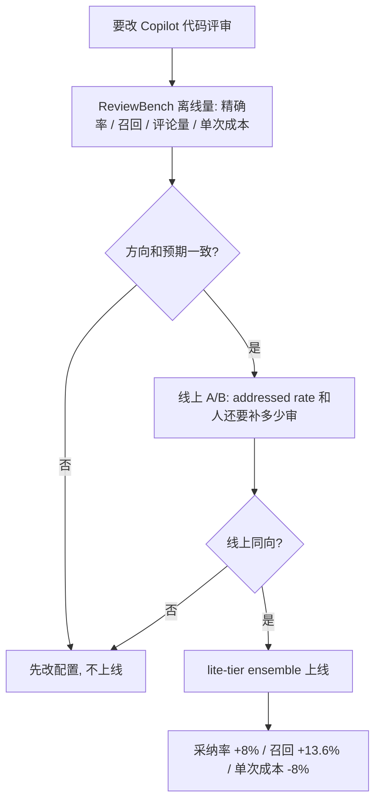

### 结论

GitHub 的 **Michelle Zhou** 和 **Alejandro Carderera de Diego** 写的是他们自己怎么改进 **Copilot code review（CCR，Copilot 代码评审）**，不是再发一篇排行榜。Agent 审 PR 已经进日常：帮你扫变更、抓问题、判断哪些评论值得人看。难的是换一个评审员、或改一版提示之后，你不知道它会不会更帮你——有的爱刷评论，有的漏关键问题，有的贵。他们做了开源离线基准 **ReviewBench**（219 个真实风格的公开 PR），用来在跑线上 A/B 之前先看方向。一个具体结果：lite-tier 上的**多模型 ensemble**（几次独立模型运行合成一条评审，而不是单次跑完就算）上线后，评论被开发者当真改代码的比例（他们叫 **addressed rate**，对应精确率）升 **8.0%**，召回升 **13.6%**，单次评审成本降 **8.0%**。评论条数多了 **61%**，但多的是关键问题，不是 nits。

### 要点

- **选 AI 评审员，先问它要帮你省哪一类时间。** 有人要少噪音，只看会出事的；有人要覆盖面，连可维护性、测试缺口也扫。ReviewBench 按严重程度（Critical / Medium / Low）和类别（正确性、安全、可靠性、可维护性、测试等）切片，还可以调 **Fβ**：β 偏向召回就是宁可多报，偏向精确率就是宁可漏报也少刷屏。排行榜会跟着你的偏好重排。没有「所有人该用的那一个」。

- **评论条数不是质量。** 他们这次 ensemble 让评论量涨了 61%。如果只看条数，分不清是多抓了关键缺陷，还是多刷了「变量名可以更好」。ReviewBench 的严重程度切片先预测 Critical 评论大约 **+227%**，线上是 **+262%**，同时中等评论变多、nits 变少。junior 容易被「这个 bot 很勤快」骗到；勤快加 nits，是在浪费审查时间。

- **离线分能对上线方向，才省得起 A/B。** 他们用 ReviewBench 迭代 CCR：量进步、抓回退、决定哪次改动值得进生产实验。线上对照是：addressed rate（一条评论是否促使开发者改了对应代码，看 diff、讨论串、反应、是否关闭、审后代码）对应精确率；还要看人还要补多少审，对应召回。过往实验里，离线涨跌和后来线上方向一致。线上仍是最终标准，但先离线筛一遍，少拿用户当试验场。

- **基准要像你真正审的 PR，不是 demo 集。** 他们看了 **1.039 亿** 条 GitHub PR 的语言、仓库体量和变更形状。ReviewBench 从 187 个公开授权仓库抽出 **219** 个 PR、覆盖 **19** 种语言，语言和仓库体量跟全站接近；PR 体量故意往「中等和偏大、值得认真审」倾斜，减少单文件小改占满集合。标准答案（**golden set**，已知该抓到的问题清单）来自真人评审、作者后续提交、静态分析、多家前沿模型，再按同一份量表去重、判定：只有真实、相关、非琐碎才算抓对。发布前，没参与建集的资深工程师从零重标，与基准判定一致率 **96.6%**。

- **固定答案集会过时；新发现的真问题也要计分。** **Grounded** 精确率 / 召回 / F1 只对照已有金标，用来公平比系统。**Augmented** 同一组指标会让评判模型单独看「金标里没有的新评论」是真是假，避免越能干的评审员因为发现了作者没标到的问题而被扣分。跨系统头条他们用 grounded 召回；augmented 当每个系统的补充诊断。

### 怎么做

面向正在给团队接 AI 审 PR、或自己做评审 Agent 的 junior：不必复刻 GitHub 这套评测栈，按同一组问题选工具、决定要不要改配置。

1. **先写清你要的评审。** 只要 Critical，还是连可维护性一起要？宁可漏报也少噪音，还是宁可多看几条？写下来，再去看 ReviewBench 排行榜的对应切片，不要看一个总分就装。

2. **改提示、换模型、上 ensemble 之前，先要一个离线方向。** GitHub 的做法是：同一批 PR、同一把尺，看精确率、召回、评论量和单次成本往哪边走。方向不对就别进 A/B。你若不用他们的网站，至少留一小份自己仓库里「曾经漏过 / 曾经误报」的 PR，改完先在这上面看。

3. **上线后对的是人有没有改代码，不是 bot 说自己审完了。** 他们的 addressed rate 看的是评论是否对应到后续 diff。抽 20 条真实评论：有几条被采纳、有几条是 nits、Critical 有没有变多。评论量上涨而采纳率下跌，就是在给审查加噪音。

4. **自建评审 Agent 可以按他们写明的流程 hill-climb。** 原文步骤：在 ReviewBench 网站用 GitHub 登录，注册 Agent（容器镜像、配置、你自己的模型密钥；评判模型他们提供），先在 25 个 PR 的测试集上看每条明细并调参，再对全部 219 个 PR 跑三轮。分数默认私有，维护者审核后、且超过该 Agent 当前榜上成绩（或第一次上榜）才公开。数据集、量表、评判提示和自助 runner 都公开。

5. **ensemble 不是默认答案，是「单次不够稳」时的选项。** 他们这次是多次独立运行合成一条评审，换来更高精确率、更高召回和更低单次成本。你先确认自己有没有重复调用的预算，再决定要不要抄这个结构。

### 关键图表

*GitHub 原文的用法：ReviewBench 先给出和后来 A/B 同向的离线信号，再把多模型合成的那一版评审推给用户*
