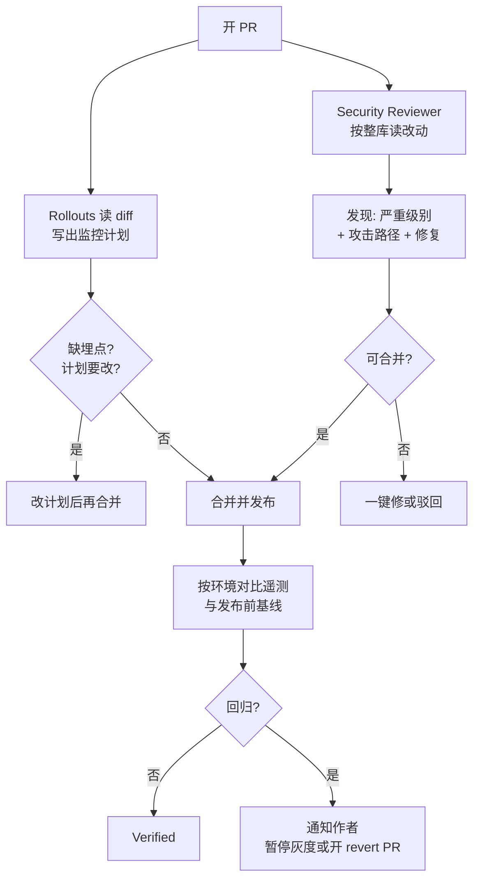

### 结论

Cursor 认为写代码已经不是最慢的环节，慢的是 **PR 之后**：安全有没有过、这次 deploy 有没有把结账打挂、延迟上涨是预期还是回归。Rustam Lalkaka 在 [Bots for the last mile](https://cursor.com/blog/rollouts-and-security-reviewer) 里发布两个机器人，专门干这类重复又吃上下文的活：**Rollouts** 从开 PR 一直看到你确信生产正常，发现回归就标出来并按配置恢复健康状态；**Security Reviewer** 在整库上下文里读这次改动，报告漏洞并给出修复。两者都在 **Teams / Enterprise** 的 Automations 页打开，面向「会自己跑的代码库」，不是再让人盯十一份同时上线的 diff。

### 要点

- **最后一公里是发布与安全，不是再写一段代码。** 官方点名的痛：确认代码安全、盯着 deploy、判断一次延迟抖动是不是真问题、从一堆变更里找出是谁弄坏了 checkout。这些活难、重复、要跨仓库 / 监控 / 发布系统的上下文——正好是 bot 该接的。

- **Rollouts 是「变更监视器」，不是又一个告警频道。** 你接上源码托管、发布系统和遥测（Datadog、Grafana、Honeycomb 等）。开 PR 时它读 diff，写出一份**监控计划**：风险、这次改动「应该」产生的效果、以及现有埋点看不清的地方。计划可以改。上线后它拿计划里的信号和发布前基线对比；发现回归时会指出嫌疑变更，并按配置通知作者、暂停灰度，或开一份等人批的 revert PR。

- **它现在擅长三件事。** 先抓「一个区域、一个接口」这种全局告警还没响的回归；把**有意的指标上升**和真回归分开，避免故意放量也把人叫起来；在合并前标出**缺埋点**——官方说这是坏变更溜进生产最常见的原因。功能开关直接加减流量、识别发布列车和 deploy freeze，还在路上。

- **Security Reviewer 走数据流，不靠正则扫字符串。** 静态分析常把 SQL 旁边的字符串拼接全标红，却漏掉重构后不再执行的鉴权。它问的是安全工程师那三个问题：用户输入从哪进来、最后落到哪、中间经过什么。开箱检查：SQL / 命令 / 模板 / LDAP 注入；新增或改过的路由上缺失、失效的认证授权；提交进仓库的密钥；不安全反序列化与未校验重定向；带已知漏洞的依赖变更；基础设施和配置里的不安全默认值。每条发现带严重级别、攻击路径和一键修复。

- **和 Bugbot 分工，且不会替你点合并。** [Changelog](https://cursor.com/changelog/rollouts-and-security-reviewer) 写明：安全归 Security Review，文风和质量仍归 Bugbot；草稿 PR 不审。回归处置可以通知、暂停灰度或开 revert，但 **不会自己合并或回滚**。本站 8 月写过 [Firetiger 并入](/clip/firetiger/)：Rollouts 就是那条「写完还要看线上」线的产品化。

### 怎么做

面向已经在用 Cursor Cloud Agent、且团队是 **Teams 或 Enterprise** 的工程师。个人 Hobby 计划没有这两项。

1. **先认清自己卡在哪一公里。** 合并很快、上线后靠人肉翻 Datadog，优先开 Rollouts。漏洞主要靠人扫 PR，优先开 Security Reviewer。两个都可以开，但不要指望它替代发布负责人或安全评审——它帮你标问题，拍板仍是人。

2. **在 Automations 里打开对应卡片。** 打开 Cursor 仪表盘的 **Automations**，在 From Cursor 下对 Rollouts 或 Security Reviewer 点 Enable。官方文档入口：[Rollouts](https://cursor.com/docs/rollouts)、[Security Agents](https://cursor.com/docs/security-agents)。

3. **配 Rollouts 的四步，缺一不可。** （1）选要监视的仓库（Origin / GitHub / GitLab.com / Bitbucket Cloud，最多约 200 个），每个会出货的 PR 会绑到作者。（2）让 CI 在生产发布开始和结束时用 Cursor API key 打部署事件；可以自己改 pipeline，也可以让 setup agent 开 PR 帮你加调用。（3）接至少一种遥测（如 Datadog）：没有数据源，变更会一直停在 pending，无法发现回归。（4）选定通知方式（作者、Slack 等）。默认会跳过纯文档、格式化和只改测试的 PR；写错了可以在评论里 @ 它改计划。

4. **看懂 Rollouts 的时间轴，再决定要不要让它动刀。** 它在发布当时、20 分钟、1 小时、1 天、3 天复查，并且**按环境分开**算：staging 通过不代表 production 通过。发现回归会点名嫌疑变更并开 issue；你可以在 issue 上启动云 Agent 修，或关掉并写原因。配置成「开 revert PR 等人批」可以，但不要期待无人值守自动回滚。

5. **给 Security Reviewer 仓库范围和最少工具。** 在 Automations 里为要审的仓库打开它，触发器用 PR / MR 事件。它需要至少一个 tool 或 MCP 才能保存。团队规则可以写成「外部调用必须走某客户端」或「请求处理器禁止直查某张表」，它会在每个 PR 上执行。发现带严重级别、攻击路径和修复建议；带原因驳回后，同一条不会在该 PR 再报。草稿 PR 默认跳过。推代码前也可以在 Cursor 3.7+ 里跑 `/review-security`，默认对比当前分支相对基线的全部改动（含未提交）。

6. **先用低风险仓库试一周，再接到结账路径。** Changelog 在发布后约 10 天内给 Teams / Enterprise 试用额度（大约 50 / 500 次变更）。从「有埋点、有金丝雀、回滚成本低」的服务开始：看它会不会把故意的指标变化当回归，以及安全发现的误报率。确认计划、通知和驳回理由都说得通，再扩大仓库范围。

### 关键图表

*PR 之后拆成两条自动线：合并前审安全与埋点，合并后按环境核验「这次改动该有的效果」；人仍负责批准回滚*
