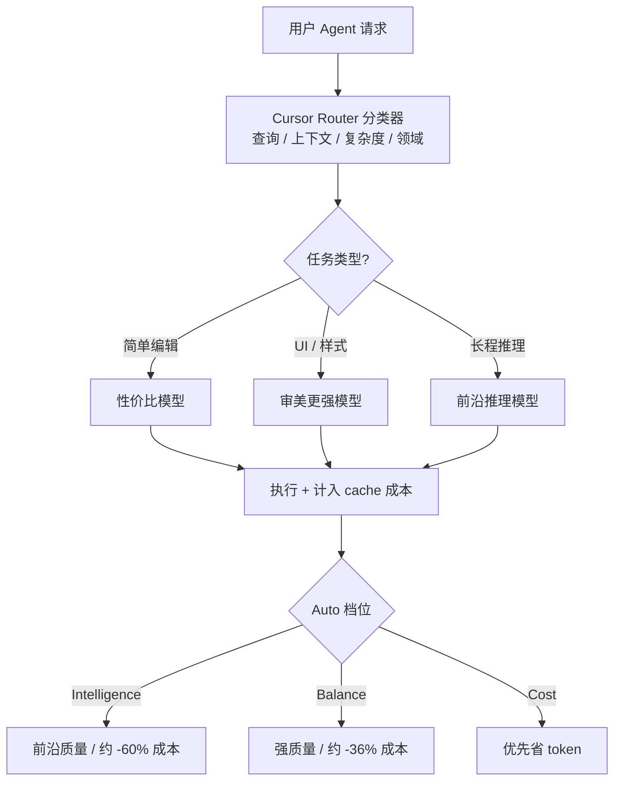

### 结论

Cursor 推出 **Cursor Router**（智能模型路由），面向 Teams 与 Enterprise：在每条 Agent 请求发出前，用分类器判断该用哪款模型，而不是全员锁死一个「日常主力」。官方在数百万次线上 A/B 中观察到，在保持前沿级输出质量的前提下，成本可降约 **60%**；早期企业客户对比「全走 Opus 4.8 定价」则普遍省 **30%–50%**，且满意度与代码留存率未明显下降。

### 要点

- **单模型日常驾驶是隐性浪费。** 官方称约六成开发者长期只选一个模型。简单改 typo、补注释也按前沿模型计价，账单涨得比产出质量快——路由要解决的是「任务难度 ≠ 统一单价」。

- **核心是请求级分类器，不是固定规则表。** 在 60 万+ 真实请求上训练，用用户满意度（AFC）作奖励信号；结合 **提问内容、上下文、任务复杂度、领域**，再叠加上 Cursor 对各模型擅长项的观测（例如 UI 审美、长程推理），决定本次调用谁。

- **简单活走低价模型，难题才上前沿。** 例行编辑去性价比高的模型；界面微调去「品味」更好的模型；跨文件、长链路推理才上最强推理模型。分类器还 **考虑缓存**：换模型会带来 cache miss 的额外成本，训练与评估都计入这一点，避免纸面省钱、实盘更贵。

- **三种 Auto 模式 = 成本–智能帕累托前沿上的三个档位。** **Intelligence** 贴近最贵前沿模型的满意度，团队成本约低 60%；**Balance** 满意度高于 Opus 4.8、成本约低 36%；**Cost** 在尽量省 token 的前提下仍追求可用智能。按「单次 commit 成本」对比：Balance 约 **$4.63**，Intelligence 约 **$6.76**，而 Fable 5 / Opus 4.8 分别约 **$12.69** / **$7.34**。

- **质量用线上行为衡量，不靠小样本离线榜单。** 主要看用户是否继续下一功能（正信号）还是反复纠正 Agent（负信号），以及 **Keep rate**——生成代码多久仍留在仓库里。官方强调路由要在「一周上百次请求、连续对话、中途换模型」的真实条件下过关。

- **组织可管、个人可选。** 管理员可按团队/用户组开启路由、设定默认可选模式、允许或屏蔽特定模型；成员在模型选择器里选 **Auto** 再挑 Intelligence / Balance / Cost。另与路由配套的还有 **动态工具调用**（常用 read/edit 常驻上下文，冷门工具首次用到再注入），进一步压 prompt 体积。

### 怎么做

1. **确认计划与入口。** Cursor Router 已面向 **Teams、Enterprise** 开放（桌面、Web、iOS、CLI、SDK）。个人版若看不到 Auto 路由，需等组织管理员开通或升级计划。

2. **模型选择器选 Auto，再定档位。** 日常大多数任务从 **Balance** 起步：质量接近大家爱用的前沿模型，花费明显更低。对关键发布、复杂架构推演可临时切 **Intelligence**；预算紧、批量机械性改动可试 **Cost**。

3. **管理员侧做分层 rollout。** 在管理后台按团队启用 Router；为不同组设默认模式（例如平台组默认 Intelligence、业务组默认 Balance）；必要时屏蔽个别高价模型，避免成员手动绕开路由。

4. **用「每次 commit 成本」复盘，而不只看单次请求价。** 路由省的是「简单请求别用前沿价」；若团队仍大量人工返工，账单下降也不会体现为交付加速——结合 PR 合并节奏与 Keep rate 一起看是否真划算。

5. **别指望路由替代清晰需求。** 分类器再准，模糊 prompt 仍可能被分到偏弱模型且反复纠错。改文件名、补测试、调样式这类边界清晰的任务最适合交给路由省钱；跨模块重构仍建议显式选强模型或开 Intelligence。

### 关键图表

*每条请求先分类再选模型；三档 Auto 决定在成本–质量前沿上的位置*
