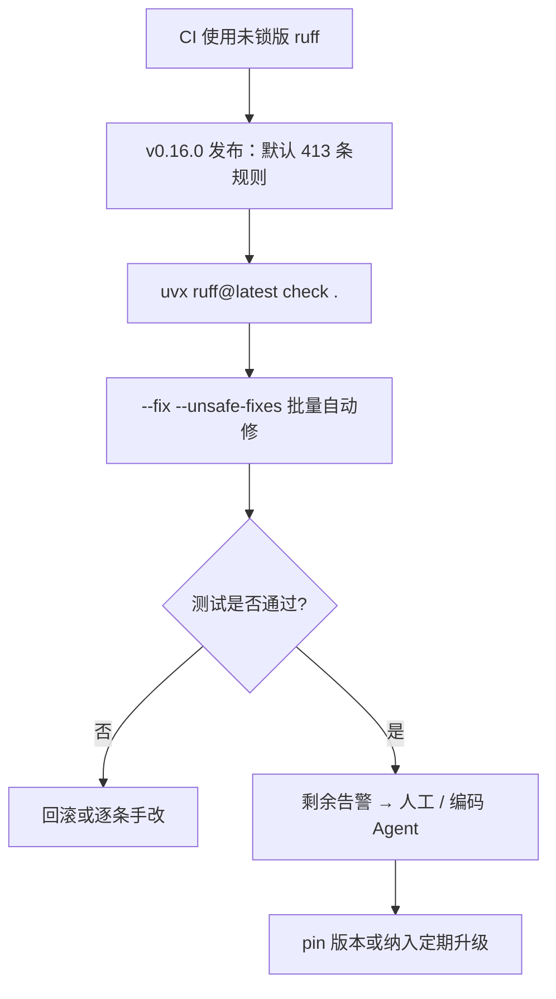

### 结论

Astral 在 2026 年 7 月 23 日发布 **Ruff v0.16.0**，把**默认启用的检查规则从 59 条扩到 413 条**。若 CI 里写的是未锁版本的 `ruff`，合并请求可能一夜之间全红——这不是 Ruff 坏了，而是新版本会主动指出以前被忽略的语法隐患、运行时风险和代码异味。应对思路：**先本地或 CI 试跑新版 → 用 `--fix` 吃掉能自动修的 → 靠测试兜底，剩余交给人工或编码 Agent**。

### 要点

- **Ruff 是什么。** 用 Rust 写的 Python **Linter**（静态检查工具），也兼做格式化，速度远快于传统 flake8 + isort 组合。Astral 出品，和 `uv` 同属一家，适合本地开发与 CI 统一代码质量门槛。

- **这次变更是「默认规则集」大修。** 自 v0.1.0 以来 Ruff 内置规则从 708 条增至 968 条；v0.16.0 把其中大量**严重问题**（语法错误、立即可触发的运行时错误等）纳入默认，无需你再写一长串 `select` 配置就能看见。

- **未锁版本 = CI 定时炸弹。** Simon 的多个仓库因 dev 依赖写成 `"ruff"` 而非固定版本，发布次日 CI 集体失败。教训：Lint 工具要么 **pin 版本**，要么在升级日主动跑一遍并提交修复 PR，别等 main 被挡。

- **`--fix` 能清掉大部分，但不是全部。** 对 sqlite-utils 跑 `check . --fix --unsafe-fixes` 报告 1618 个问题，自动修了 1538 个，**还剩 80 个需人工或 Agent**。`--unsafe-fixes` 表示允许可能改变语义的自动修复，大仓库升级前务必有测试覆盖。

- **剩余告警对 AI 很友好。** 例如 `DTZ005`（`datetime.now()` 未带时区）、`BLE001`（裸 `except Exception`）、`B018`（无意义的属性访问）。Ruff 会标文件、行号并给 `help` 提示，正好适合 Codex、Claude Code 等编码 Agent 逐条改。

### 怎么做

1. **在任意 Python 项目根目录试跑最新版**（无需先安装，用 `uvx` 临时拉取）：

```bash
uvx ruff@latest check .
```

2. **评估冲击面**：看报错数量与类型。有完整测试矩阵（如 Python 3.10–3.14）时，批量自动修复相对安全：

```bash
uvx ruff@latest check . --fix --unsafe-fixes
```

3. **处理修不掉的项**：按 Ruff 输出的规则码（如 `DTZ005`）逐条改，或把报错片段贴给编码 Agent，让它按 `help` 建议改（补 `tz=`、收窄 `except`、删掉无用表达式等）。

4. **固化 CI 策略（二选一）**：
   - **保守**：在 `pyproject.toml` 或 workflow 里 **锁定 `ruff==0.16.0`**（或你验证过的版本），计划性升级；
   - **激进**：接受浮动版本，但在 Dependabot/定时任务里跑 `ruff check`，升级当日专门开修复 PR。

5. **合并前跑全量测试**。自动修复可能动到测试代码里的「偷懒写法」，测试绿了再合；Simon 对 Datasette、sqlite-utils、LLM 三个大仓库均用此流程，由不同 Agent 收尾剩余项。

### 关键图表



*升级路径：先暴露问题 → 自动修大头 → 测试守门 → 收尾并决定版本策略*
