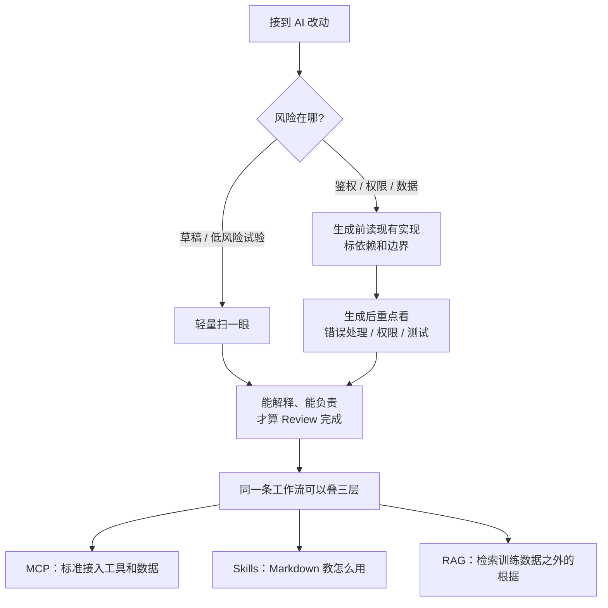

### 结论

GitHub 在 [播客配套文](https://github.blog/ai-and-ml/should-you-read-the-code-is-rag-dead-and-did-skills-kill-mcp) 里把五条 AI 热梗拆开：**热梗适合转发，不适合当工程规范。** 你仍然要读 AI 生成的代码，停手标准是「能解释、能对结果负责」；**MCP**（Model Context Protocol，模型上下文协议）管标准接入，**Skills** 管怎么用好这些接入，**RAG**（Retrieval-Augmented Generation，检索增强生成）管把训练数据之外的根据找来——三者可以出现在同一条工作流里，不是淘汰赛。对 junior 更有用的是：先问「在什么条件下成立」，再按风险分配注意力。

### 要点

- **「不用读 AI 写的代码」不成立，但也不等于每一行同等用力。** 你还是负责人。生产环境的鉴权重构，和一次 CSS 试验，审查力度不该一样；维护了十年的仓库，和今天刚打开的仓库，本能也不一样。假装风险相同不是严谨，是浪费时间。简单规则：**Review 到你能解释、能拥有这个结果为止。**

- **注意力可以前移，也可以后移，工作不会消失。** 有时在 Agent 动笔前就要读现有实现、标依赖、找边界、做计划，等第一版出来时你已经知道「该做成什么样、哪里会翻车」。有时重点在生成之后：错误处理、权限、数据访问、性能、无障碍和测试。AI 只是把力气挪了位置。真正的技能是知道风险在哪。

- **招聘问「你会不会用 AI」是真的，但更强的信号是判断力。** 更多团队会问你怎么用这些工具。没人要求同一套工作流、同一批工具、同一份热情。你要讲得清：什么时候用 AI、什么时候手写；生成代码怎么 Review；速度、质量、安全和可维护性你怎么取舍；工具变了你怎么改流程。做 AI 产品或重度使用 AI 的团队，完全拒绝碰可能不匹配；全盘依赖和全盘拒绝通常都不是好答案。这种「能讲清自己怎么干活」的流畅度，正在变成手艺的一部分。

- **Skills 没有杀死 MCP，它们解决不同问题。** MCP 给 Agent 一套连接工具和数据的标准方式：结构化地调工具、取上下文、执行动作，系统才能可靠地拼在一起。Skills 更接近打包好的专长：团队怎么协作、项目该怎么改、工具该怎么用、哪些约定算数。Skills 常用 Markdown 写，人也能读，可读性本身就是价值。一句话：**MCP 提供接入，Skills 解释怎么把接入用好。** 共享接口用标准，上下文、流程和最佳实践用 Skills。

- **RAG 没死，只是不够「新」、不够适合发帖。** RAG 的作用是给模型训练数据之外的相关信息：文档、客服历史、产品细节、内部知识、代码上下文。没有好的检索，模型只能靠已经知道的东西，或花额外时间去找上下文——浪费 token、变慢、更容易答不全。好的检索让模型从更靠近答案的地方起步，缩小搜索空间，把回答钉在真正要紧的材料上。Agent、Skills、MCP、RAG 可以同场：Agent 用 MCP 调工具，按 Skill 遵守项目约定，再用检索拿到支撑上下文。

- **「必须为代码库微调模型，说明代码很烂」过于绝对，但可维护性确实会被 AI 加压。** 微调有正当理由。现代模型已经见过大量常见框架、模式、命名和架构；如果模型读不懂你的仓库，新同事也很可能读不懂。AI 正在变成又一项可维护性压测，和 Code Review、测试、入职、以及六个月后那个倒霉的调试者并列。结构清楚、命名一致、测试可读、抽象有用、文档不过期——这些既帮 Agent，更帮人审查、调试和扩展。意图写明白的代码库，在 AI 辅助开发里更占便宜。

### 怎么做

面向已经在用 Copilot / 编程 Agent，却被热梗带着跑的工程师：

1. **先给改动定风险档，再决定 Review 预算。** 鉴权、权限、付钱、删数据 → 按生产变更审。一次性样式、本地草稿 → 扫到能讲清结果即可。不要用「我读了每一行」伪装严谨。

2. **高风险路径：生成前先读现有实现。** 画出依赖、标出边界条件、写清「做成什么样算对」。等 Agent 交第一版时，你已经有对照，而不是从零猜它想干什么。

3. **生成后按清单看，而不是从第 1 行滚到最后一行。** 错误处理、权限、数据访问、性能、无障碍、测试。讲不出「失败时会怎样」，就还没到能负责的程度。

4. **面试或周报里练判断力，不练工具信仰。** 准备三句话：我什么时候用 AI、什么时候不用；我怎么 Review 生成代码；我把人留在回路的哪一步。工具名单可以变，这条解释不能空。

5. **同一条 Agent 工作流按层叠，不要投票选赢家。** 需要稳定接入工具/数据 → MCP；需要项目约定和操作手册 → Skills（人能读的 Markdown）；需要训练数据里没有的根据 → RAG。缺哪层补哪层，而不是把另外两层宣布死亡。

6. **模型读不懂仓库时，先当可维护性问题，而不是先开微调。** 命名、结构、测试和文档能否让新同事上手？能，再评估微调是否真有独特理由。不能，先把意图写清楚。

7. **用一次真实试验回答热梗，不要再用一条热梗回击。** 原文结尾的姿势是：测这个想法、做出来、记下发生了什么。GitHub 点名的例子是 [Pollinations AI](https://pollinations.ai)（贡献换积分）和 [Avian Visitors](https://theodore.net/projects/AvianVisitors/)（听鸟的电子墨水屏构建日志）——它们不结束辩论，但能交出证据和取舍。

### 关键图表

*GitHub 原文的拆法：热梗要问「在什么条件下成立」。人负责结果；MCP / Skills / RAG 分层互补，不是互斥*
