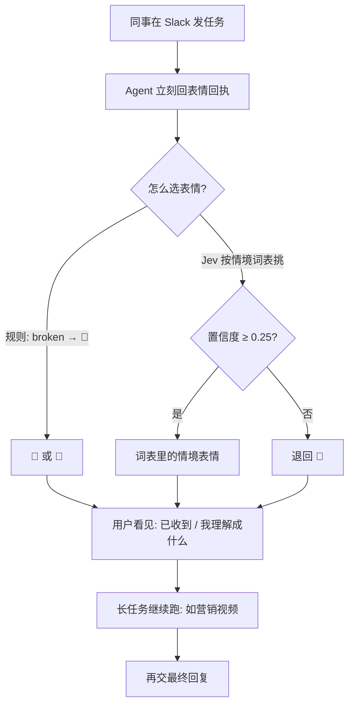

### 结论

LangChain 工程师 **Nathan Drezner** 写的不是再发一篇「怎么搭 Agent」，而是他们自己怎么让**非开发同事**敢用内部 Agent。Applied AI 团队上线了一个做视频和动态图形的营销 Agent：任务要跑很久，用户不知道消息有没有被收到、理解成了什么。**Managed Deep Agents**（LangChain 托管的长任务 Agent）v0.9 给 Slack 加了 `reactions`：消息一进来，先回一个表情当**回执**（receipt，表示「我接到了」）。可以写 `if`，也可以让决策模型 **Jev** 从一张词表里挑。作者的判断：用户信任 Agent，是因为看得见它在干什么，而不是因为它最终会交一份完美答卷。

### 要点

- **长任务先给回执，比先给完美回复重要。** 很多 Agent 活要跑很久。中间若完全沉默，用户会以为没收到、卡死了、或者自己说错了。Drezner 把这种「先告诉你我在干活」叫 **loading state**（加载状态）。他拿 Domino’s Pizza Tracker 作比：数字界面模仿现实物件（skeuomorphic，拟物），用户才能把等待过下去。即使加载状态偶尔不完全诚实，也比空白好。

- **`reactions` 可以是固定表情，也可以是函数。** Slack 频道上这个属性接受两种东西：一个表情字符串，或一个根据上下文返回表情的可调用函数。最简单的客服 Bot：默认 👀；消息里出现 `broken` 就改 🐛。这是静态规则，不调模型，也能让用户立刻看见「Bot 接到了，而且听出这是缺陷」。

- **表情要写情境，不要写图案。** 同一个 🔥，值班 Agent 可能表示生产在烧、该起床；增长 Agent 可能表示活动奏效、可以继续睡。模型匹配的是你写的**情境描述**，不是 emoji 名字。词表里要留一项「都不像」——他们用 👀 兜住平淡消息，避免硬套一个夸张符号。

- **Jev 适合从封闭词表里挑，但要设置信度门槛。** Jev 是决策模型：不写长文，只对一份 **state**（当前上下文，这里是消息前 2000 字）回答带类型的问题。单题最多 255 个选项；要更多，可以先选类再选表情。他们用 `TypeSafeClassifier`（带类型的分类器）接 `typesafe/jev-latest`，也可以换成 SemIf 等接在 LangSmith LLM Gateway 上的决策模型。置信度低于 **0.25** 就退回 👀——模型其实没看清时，宁可给一个中性回执，也不要装懂。

- **内部内容 Agent 用自定义表情讲工作规范。** 词表可以加 Slack shortcode（`:bug:` 这种短码）。Applied AI 给内容 Agent 做了一套自定义表情；作者点名喜欢 `lc-no-em-dash`：当指示「按规范写内容」时，Agent 会选它。回执同时在说两件事：我收到了，以及我按哪条规矩理解你的任务。

### 怎么做

面向正在把 Agent 丢进 Slack、给非开发同事用的 junior：不必上 Jev，先把「沉默」去掉。

1. **先定「收到了」的回执。** 长任务（生成视频、查一堆系统、写一版方案）一进频道就回一个表情。用户要的第一件事是确认，不是最终成片。

2. **词表按本频道的工作写情境。** 客服写缺陷、事故、提问；内容写「按规范写」「在等素材」。描述写「这是一次已宣布的故障」，不要写「这是一个旋转灯」。

3. **留兜底。** 规则没命中、或模型置信度低，退回中性表情或干脆不回。不要为了「显得聪明」硬选一个会误导值班的符号。

4. **不同 Agent 用不同词表。** 值班和增长不要共用 🔥 的含义。一个 Bot 一张词表，写进代码，不要靠提示词里的口头约定。

5. **描述写具体，避免过拟合。** 打分模型和干活的模型不是同一个，解释会有偏差。某条描述太泛，模型会过度选它。上线后抽几条真实消息：回执是否对得上用户的意图，而不是只看「有没有表情」。

### 关键图表

*LangChain 原文的用法：先回执、再干活；规则或 Jev 只负责「我怎么理解你」，长任务本身还在后面*
