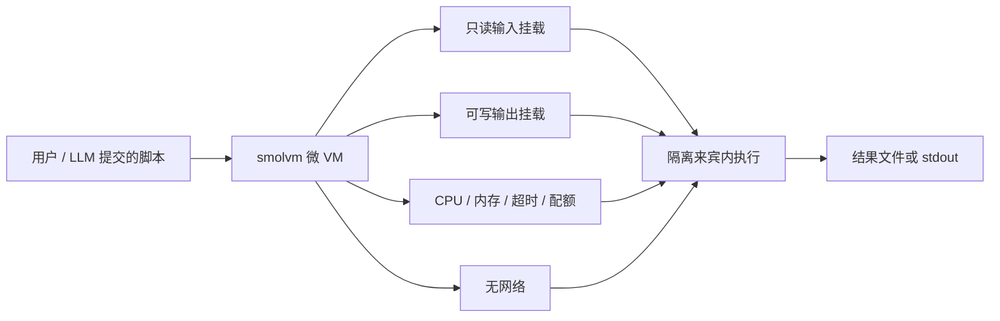

### 结论

若要在产品里执行**用户或 LLM 生成的 Python / JavaScript**（例如 CSV 清洗、JSON 转换），共享内核的容器往往不够硬：**smolvm** 用 Firecracker 微虚拟机做硬件级隔离，实测 1.8.3 在断网、限资源、只挂载指定目录等约束下均可工作。冷启动约 0.6–1.5 秒、热执行约 50 ms，适合「偶尔跑一段不可信脚本」的 Agent 工具链，而不是长期常驻的批处理集群。

### 要点

- **微 VM 比「容器沙箱」边界更硬。** 容器与宿主机仍共享内核，配置失误时逃逸面更大；smolvm 基于 **KVM + Firecracker**（AWS Lambda 同款思路），每个任务在独立来宾系统里跑，宿主机进程与凭证默认碰不到。

- **资源与网络可以确定性封顶。** 实测可用的旋钮包括：CPU / 内存上限、来宾内超时（防 `while true` 占满）、磁盘配额、`--unprivileged` 降权、**完全断网**、只读输入挂载 + 可写输出挂载。这些不是「模型尽量别乱来」，而是内核 / hypervisor 层硬拦。

- **离线镜像，不依赖运行时拉包。** smolvm 用本地预置镜像启动，执行环境可审计、可复现；适合「只允许跑我们打包好的 Python / Node 运行时 + 固定依赖」的场景，而不是让用户随意 `pip install`。

- **嵌套虚拟化是常见坑。** Simon 让 Claude Code for Web 做调研时，容器本身已是 Firecracker 来宾，**没有 `/dev/kvm`**，`smolvm machine run` 直接失败。要在 CI 或裸金属上测，需选暴露 KVM 的 runner（如 GitHub Actions 的 `ubuntu-latest`），不能假设任意云 IDE 都能 nested virt。

- **适合 Agent「工具步」而非重型计算。** 秒级冷启动 + 毫秒级热跑，定位是安全地跑短脚本；大批量 ETL 或 GPU 训练应另选专用队列，别把微 VM 当通用算力池。

### 怎么做

若你正在给 Agent 或 SaaS 加「执行用户代码」能力，可按 smolvm 思路落地：

1. **先定威胁模型。** 假设代码恶意：无限循环、读 `/etc/passwd`、外联偷凭证、写满磁盘。每条都要有对应硬限制（超时、无网、路径白名单、配额），不要只靠 prompt 说「请别这么做」。

2. **输入输出走挂载，不进交互式 shell。** 把待处理文件挂成**只读**，结果写到**单独的可写目录**；Agent 只提交脚本路径或 stdin，避免给用户代码完整的文件系统浏览能力。

3. **镜像与依赖自己控。** 预构建含 Python / Node 的 smolvm 镜像，版本锁死在 CI；用户代码只能调用镜像里已有的库，需要新依赖时走你方审核后再发新镜像。

4. **在能开 KVM 的环境集成。** 本地开发机或 CI runner 需有 `/dev/kvm`；Serverless 容器、部分 IDE 沙箱无法嵌套虚拟化。集成前用 `smolvm machine run` 冒烟，别等到上线才发现 `kvm not available`。

5. **把冷启动算进 UX。** 首次约 1 秒可接受作「点一下转换」；若同一用户连续多步，尽量复用 warm 实例或合并步骤，避免每步都付冷启动成本。

6. **与模型层防御叠加。** 环境隔离解决「能碰到什么」；仍要用分类器 / 审批拦明显恶意 prompt。二者互补，参考 Anthropic「Containment 优先于逐条点允许」的做法。

### 关键图表

*不可信代码只在微 VM 内运行：数据从只读目录进、结果往指定目录写，资源与网络在 hypervisor 层封顶，与宿主机和其他租户隔离。*
