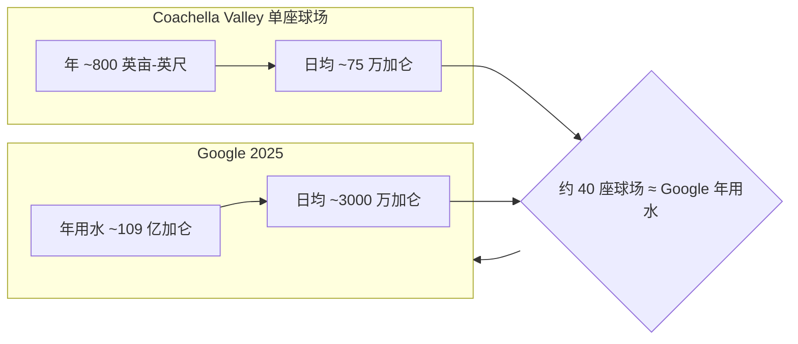

### 结论

AI 超大规模数据中心因耗水挨骂时，Simon Willison 用一句玩笑点破叙事问题：**别只盯着机房，先把更「显眼」的耗水大户摆到同一张账上**。Google 2025 年用水约 109 亿加仑（日均约 3000 万加仑）；加州 Coachella Valley 120 座高尔夫球场，每座年耗约 800 英亩-英尺（日均约 75 万加仑）。买下其中约 40 座（三分之一）的用水量，就能「对冲」Google 全年用水——这不是正经基建方案，而是提醒工程师：**环保争议里，数字要对得上，叙事也要会换位**。

### 要点

- **Hyperscaler 耗水是真实议题。** 训练与推理集群需要冷却塔、蒸发散热，干旱地区建数据中心会直接牵动当地供水。Google 等厂商已公开用水数据，媒体和监管也会拿「AI 吃水」做文章——做 AI 产品的人不能只会说「我们用电」，还要能解释用水量级与缓解措施。

- **类比的价值在数量级，不在可行性。** Willison 的「买下乡村俱乐部、把球场改公园、请向导带前会员观鸟」纯属讽刺；但算术有用：日均 3000 万加仑 vs 单座球场日均 75 万加仑，40 座球场 ≈ 一家 hyperscaler 年用水。读新闻或写对外材料时，先问「对手方数字是年还是日、单位是加仑还是英亩-英尺」。

- **「Spot birds not golf」是叙事框架，不是技术方案。** 公众对高尔夫的奢侈耗水已有直觉反感，把 AI 耗水放在同一坐标系，是在说：批评 AI 基建的人，是否同样关注其他高耗水休闲产业？工程师不必站队玩笑，但要识别**舆论场在比什么**——是总量、是当地稀缺性，还是「谁更该让步」。

- **英亩-英尺（acre-foot）是美西水利常用单位。** 1 英亩-英尺 ≈ 约 32.6 万加仑，表示覆盖 1 英亩、深 1 英尺的水量。看到球场「年 800 英亩-英尺」时，心算成日均加仑，才方便和企业的「年用水十亿加仑」放在一张 mental model 里。

- **别用讽刺当免责。** 类比能澄清规模，不能替代减排：液冷、再生水、选址、披露 ESG 指标仍是正经工作。Willison 的标签是 `ai-energy-usage`——耗水与耗电、碳排同属 AI 基础设施外部性，产品叙事里要留位置。

### 怎么做

1. **接到「AI 太费水」类问题时，先拉齐单位。** 把企业披露的年用水 ÷ 365 得日均；地方产业（农业、球场、居民）用同一单位。避免「十亿」对「百万」造成的数量级误判。

2. **建一张自己的对照表（不必公开玩笑版）。** 例如：公司年用水、当地人口人均、邻近高耗水行业单项。对外 FAQ 或内部分享时用**可核查的第三方数字**，少写「我们其实很省」这种空话。

3. **区分「全球叙事」和「选址争议」。** 全球总量是一回事；在缺水河谷新建园区是另一回事——后者看的是**当地边际影响**与替代用途，类比球场也是在强调「同一流域里谁在用水」。

4. **产品/工程侧可落地的回应方向：** 优先干冷或液冷、复用再生水、热负荷与电网/水务规划同步披露；若做 Agent 或训练管线，在成本估算里把**能耗与水耗**和算力并列，别只报 GPU 小时。

5. **读 Willison 这类短帖的方法：** 提取可验证数字 → 忽略不可能的「解决方案」→ 带走**如何向公众解释规模**——这比背梗更重要。

### 关键图表

*数量级对齐后，再讨论 AI 基建是否该建、如何减排——玩笑里的算术才是可带走的工具*
