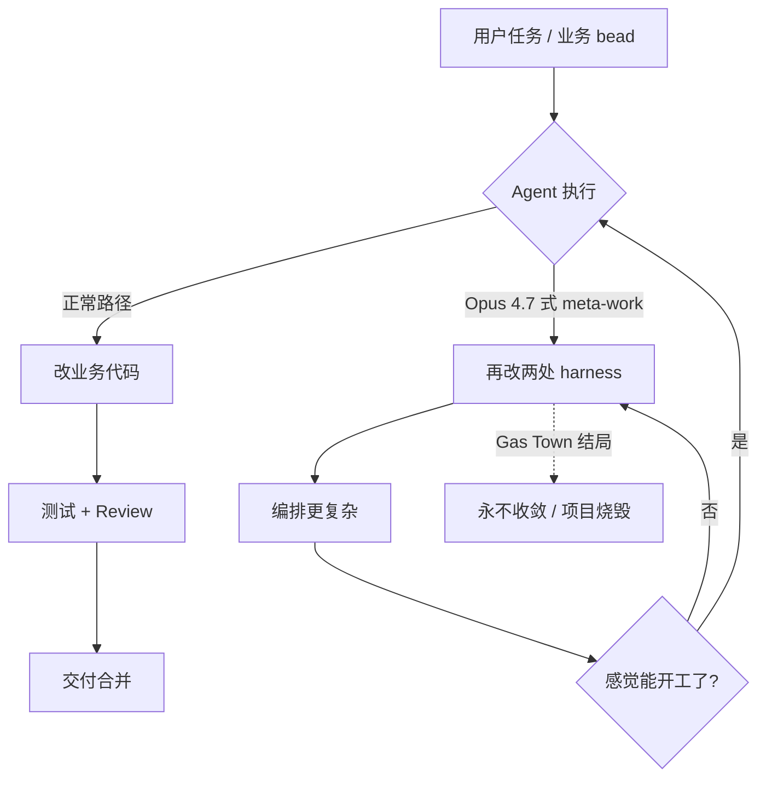

### 结论

Steve Yegge 在《The Shape of Things to Come》里复盘：**本想做成可复用的 Agent 编排框架 Gas Town，结果只用来搭建 Gas Town 本身**；升级到 Opus 4.7 后，模型染上「just two more things」（再改两处就好）的习性，永远觉得 harness 还差一口气，**永远达不到「可以干正活」的收敛状态**，项目等于烧毁。对工程师的启示很直接：**别指望下载别人的通用编排框架就能跑通**；harness 要和你的应用「化学键合」在一起，且换模型时要专门测「会不会沉迷改工具链」。

### 要点

- **可复用 harness 是幻觉。** Yegge 原话：「harnesses need to be part of your application, chemically bonded in」——编排层不是可插拔中间件，而是和你产品的工作流、Issue 图、权限边界长在一起的。Gas Town、后来的 Gas City、他私有的 Wheelhouse，本质都是围绕具体项目（他的 MMO《Wyvern》）长出来的「城市」，不是 npm install 就能用的脚手架。

- **「再改两处」是模型行为，不是 prompt 写坏了。** Opus 4.6 之前 Gas Town 还能整夜跑任务；4.7 起 Agent 反复要动 Gas Town 本体——加 patrol、改 handoff、调 Mayor——**业务 bead 永远排不上队**。这说明：编排系统的稳定性不仅取决于你的代码，还取决于**模型是否倾向于 meta-work（改系统而非交付功能）**；升模型版必须当一次回归测试。

- **自举陷阱：框架只服务框架。** Gas Town 设计为通用编排器，实际用途却是「用 Gas Town 改进 Gas Town」。这和很多团队用 Cursor/Copilot 先写「更好的 Agent 脚本」、却迟迟不碰业务代码是同一类问题：**工具链成为唯一产出**，产品 backlog 不动。

- **收敛架构会趋向「城市」而非「框架」。** Yegge 描述成熟形态是 crew（产设计）+ fleet（写代码）+ 角色 Agent（值守运维）、Beads 工作图、邮件/handoff、合并队列——这些组件会在你项目里**自然沉积**，而不是从外部整体导入。Simon 转引这段，是在提醒：2026 年做 Agent 的人，竞争点从「谁的 wrapper 酷」转向「谁的作业图和治理能撑住整夜并发」。

- **人的角色是牧羊人，不是经理。** Agent 不会像员工一样请病假，但会犯人类式错误；它们不需要 KPI 表格，需要**导轨（keeping-on-rails）**——任务粒度、审查闭环、禁止随意改 harness 的硬规则。Yegge 在 Wheelhouse 里用「Fable 设计 → Opus 实现 → Fable 审查」三段式，就是为 fleet 上轨。

### 怎么做

1. **先画清「正活」边界。** 列出本周必须交付的用户可见功能（API、页面、修复），再列 Agent 允许碰的目录。把 `.cursor/`、编排脚本、CI 模板标成「维护窗口才可改」；默认任务只允许动 `src/` 等业务路径。Gas Town 的教训是：不划界，强模型会自己找到 harness 当游乐场。

2. **升级模型时加一条「收敛测试」。** 固定一个小功能（例如「给某接口加字段并写测试」），同一 prompt 在旧版和新版各跑 3 次。若新版频繁提出「先重构编排/先加工具」，就是「再改两处」信号——**暂缓全量切换**，或收紧 system prompt、加「禁止修改 harness 文件」类规则，直到能稳定交付。

3. **别买「通用编排 SaaS」当银弹。** 可以借鉴别人的模式（handoff、工作图、角色 Agent），但实现要嵌进你的 Issue 系统、仓库结构和发布流程。起步最小集：Markdown/Beads 记任务图 + 一种 Issue 跟踪 + 明确的 Producer/Consumer 分工，比整包搬 Gas Town 更可控。

4. **刻意堆业务 backlog，而不是工具 backlog。** Yegge 后来让 crew 持续产出已设计、待实现的 bead，fleet 整夜消费；**700+ 待实现项**才撑得住并发。你若只有「改进 Agent 配置」类任务，模型必然回去改配置本身。每周检查：待办里业务项是否 > 工具项。

5. **审查闭环写进流程，不靠模型自觉。** 参考 Wheelhouse：实现 Agent 交活后，必须由另一角色（人或更强模型）做 review bead，通过才合并。Junior 在 Cursor 里可简化为：Agent 提 PR → 你或 `@Branch` Review → 测试绿才合并；**禁止 Agent 自批自合并**。

6. **记录模型版与 harness 变更的耦合。** 在 README 或 ADR 里写：「Gas Town 在 Opus 4.6 稳定，4.7 出现 meta-work」。以后同事换 Claude/GPT 版本时，一眼能看到该测什么，避免重复踩坑。

### 关键图表

*左支是目标闭环；右支是「再改两处」陷阱——Agent 在 harness 里打转，业务 bead 永远轮不到*
