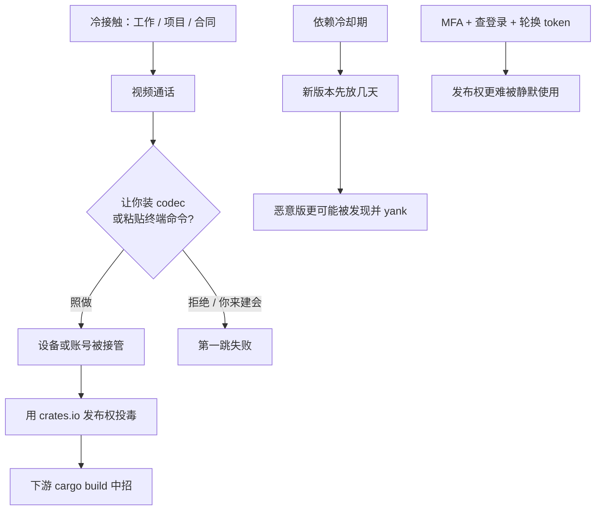

### 结论

Simon Willison 把 [Rust 官方博客](https://blog.rust-lang.org/2026/09/17/targeted-attacks/) 的紧急警告放进链接博客：crates.io 团队和安全响应工作组（Adam Harvey 执笔）认为，**针对 rust-lang 成员和热门 crate 所有者的定向攻击仍在进行**。目标不是当场偷代码，而是拿设备和账号，再用这些发布权往 [crates.io](https://crates.io/) 上发恶意包。手法很「体面」：先约一通看起来像工作、项目或合同的视频通话，再让你装所谓缺失的音频编解码器，或把一条命令放进剪贴板让你执行。上个月 [arrayref](https://blog.rust-lang.org/2026/08/20/supply-chain-attack-on-arrayref/) 等 crate 已被类似路径攻破。Simon 的防守判断很务实：**现在最管用的是依赖冷却期**——新版本先放几天，等别人先踩雷。

### 要点

- **攻击面是「有发布权的人」，不是某一行代码。** Simon 写明：几乎所有软件都依赖开源，依赖网络里每一个有发布权的人都是潜在入口。crate 是 Rust 的包；crates.io 是官方仓库。拿下热门 crate 的账号，一次 `cargo build` 就能把恶意代码送到下游机器——因为 Cargo 会在编译时跑 `build.rs`（构建脚本），不必等你的程序真正调用那个库。

- **视频通话是第一跳，不是钓鱼邮件本身。** 官方描述的流程是：先约一件「好事」（工作、项目、合同），通话中再让你装「缺失的音频编解码器」，或执行剪贴板里的命令。编解码器（codec）本该是让麦克风/扬声器工作的驱动或插件；攻击者借「你听不见我」的压力，让你在几秒内装不明软件。剪贴板向量更简单：对方说「把这段贴进终端」，你一粘贴就等于在本机以你的权限执行命令。

- **公司主页和 LinkedIn 经得起「扫一眼」。** 攻击者会建看起来合法的新公司资料，包括像样的 LinkedIn。官方提醒：对**冷接触**（cold outreach，你不认识的人主动找上门）保持怀疑；通话尽量用你已经在用的平台，**最好由你来建会**——别点对方发来的陌生会议链接。

- **上个月 arrayref 已经中招。** 官方说：6 月有过一轮针对知名 Rust 开发者的同类攻击；8 月 `arrayref`（以及同一账号下的 `internment`、`append-only-vec`）被短暂攻破，恶意版本会拉进伪装成 `proc-macro2` 的 `proc-macro1`。官方目前**不能确认**这些是否同一场战役，但手法同类。这种「先拿维护者、再投毒包仓库」的风格，也被指出常见于朝鲜（DPRK）相关行动，且不只出现在 Rust 社区。

- **依赖冷却期买的是「被人发现」的时间。** Simon 的建议不是「永远不升级」，而是给新包版本几天窗口：供应链攻击往往在发布后很快被发现并 yank（从索引下架）。CI 里不要 `cargo update` 到刚出几小时的版本。冷却期挡不住已经被攻破、且你已经锁进 `Cargo.lock` 的版本，所以还要配合账号侧的 MFA（多因素认证）和登录检查。

### 怎么做

面向会写 Rust、会 `cargo update`、或自己维护开源包的工程师：

1. **冷接触默认当钓鱼。** 自称招聘、尽调、合同、开源合作的视频通话，先核对方身份：公司域名邮箱、你能独立搜到的公开信息、熟人引荐。LinkedIn 公司页「看起来像真的」不够。官方建议：近一段时间格外小心。

2. **会议链接你来建，平台你来选。** 用你日常已经登录过的 Zoom / Meet / Teams，由你发邀请。通话中任何人让你「装一个 codec / 下某个驱动 / 把命令贴进终端」——直接结束通话。正版会议软件不会在通话中途要求你在终端执行一段未知命令。

3. **立刻核对自己的发布账号。** crates.io、GitHub、邮箱都打开 MFA；看一遍近期登录、SSH key、个人访问令牌、crates.io API token。有异常就轮换 token、作废旧 key。crates.io 账号问题写 [help@crates.io](mailto:help@crates.io)；其余写 [security@rust-lang.org](mailto:security@rust-lang.org)。官方写明他们愿意帮忙。

4. **给依赖加冷却期，而不是关掉升级。** 在 CI 或 Dependabot / renovate 里设 delay（例如 2–7 天）再合并版本 bump；生产锁文件不要追「今天刚发布」的 crate。升级前扫一眼 changelog 是否突然多了从未出现过的依赖（`arrayref` 中招时，十年历史里第一次加依赖就是恶意的 `proc-macro1`）。

5. **如果你维护的 crate 有发布权：缩小「能发版的人」集合。** 发布 token 不要长期放在笔记本明文里；CI 发布用短期、最小权限凭证。同事发来「帮我测一下这个会议软件」时，用另一台没有发布密钥的机器，或直接拒绝在开发机上装来路不明的东西。

### 关键图表

*Harvey / crates 安全组的主线：先拿维护者，再拿包仓库；Simon 补的防守是给新依赖几天冷却，同时管好发布账号*
