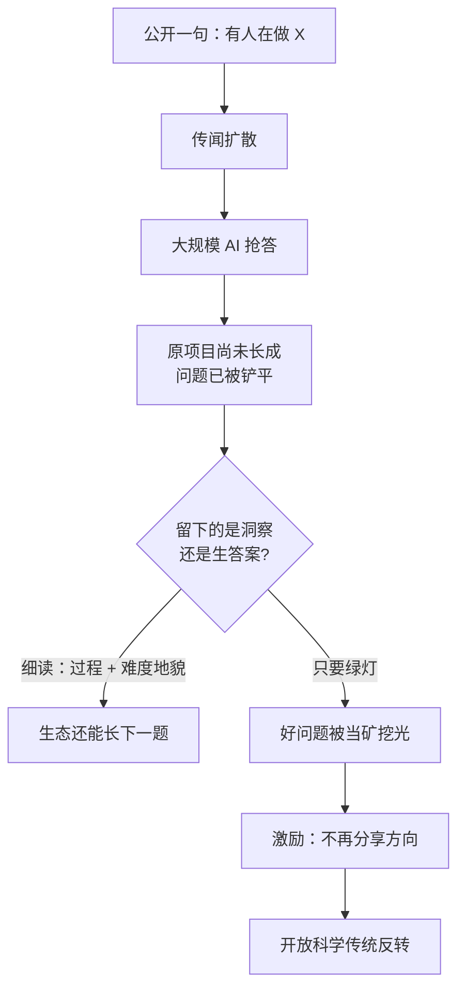

### 结论

Simon Willison 在 9 月 9 日摘了一段 [陶哲轩（Terence Tao）的 Mathstodon 长帖](https://mathstodon.xyz/@tao/117237320796901560)：**真正「好、能长出后续」的开问题，正在被当成不可再生资源开采**；更扎眼的是后半句——**连「有人在做这道题」的传闻，都足以触发大规模 AI 抢答**，把原项目还没长出来的潜力先铲平。激励如果继续这样偏，研究者会不再向社区分享有希望的方向，等于倒转几百年的开放科学传统。对工程师，这不是纯数学八卦，而是同一条新规律：**公开一句「我们在攻 X」，就已经把发令枪打响了。**

### 要点

- **问题无限，不等于「好问题」无限。** 陶哲轩用喝水打比方：一个地区可以同时缺饮用水、却被海洋包围。你随时能编无限道数学题（比如算 π 的第 `10^10^10` 位），但绝大多数既不长洞察、也不连向别的问题，相对已知方法要么太容易、要么太不可能，练不出东西。稀缺的是**有肥力的开问题**，不是题目的个数。

- **「难度地貌」被铲平之后，就找不到下一题。** 判断一道题值不值得盯，靠的是对领域难度地貌的体感：哪些用现成方法秒杀、哪些费力可解、哪些目前不可能。新工具（技术、基础设施、文献库）会降低解题难度，这通常是好事；但也会把地貌铲平，让人看不清「在这件工具的射程里，下一道有希望的题在哪」。过去新工具还会把可及半径拉大、露出新边界；陶哲轩认为当前 AI 时代**几乎没有稳定边界**——「AI 能做」和「AI 做不动」之间没有清楚前线，因为技术变得太快，而且公司**不公开失败案例，也不公开解题过程**。

- **稀缺资源已经从「答案」换成「找出有希望的问题」。** 帖子里最锋利的一句，也是 Simon 标出来的：现在连传闻都能招来海量 AI 算力，赶在原研究项目长到完整潜力之前把它铲平。于是激励指向**不再和社区分享有希望的方向**。

- **只交「生答案」可能是负贡献。** 陶哲轩把乱挖比成食物捐助：现在不再来者不拒，只要「技术上能吃」就收，而是有社会接受的标准。对开问题，他希望许多类别被标成「需要细读」：不但要解，还要从过程里抽出洞察、摸清邻近题的难度地貌；**没有这种分析的生答案，价值接近零，甚至为负**——因为它毁掉了下一波进展赖以生长的生态。

### 怎么做

面向会用编码 Agent、也会在公开渠道聊方向的工程师和研究者：

1. **把「公开方向」当成发令枪，而不是闲聊。** 发推、开 issue、写 RFC、在播客里说「我们准备攻 X」之前，先问：如果对手（或另一家实验室）今晚就用 Agent 海量试错，你是否已经写好可验证的洞察、过程记录和「邻近问题」清单？还没准备好，就先走私人 advisory、内部 RFC 或延迟公开——和本站 8 月 29 日网摘里「补丁传闻即探测」是同一类窗口。

2. **用 AI 解题时，默认要「过程」，不要只要绿灯。** 提示里写清交付物：关键引理/决策为何这样选、失败过哪些路径、邻近什么题因此变容易或变难、哪些步骤人还能复述。只交一段「已解决」的 diff 或证明证书，正好落入陶哲轩说的生答案。

3. **给问题分类，而不是一律交给最大模型。** 工单、回归、明确验收的实现题——可以 flatten，追求速度。还在长洞察、还要带新人、还要画难度地貌的题——标成「细读档」：允许慢、要求人读中间产物、禁止把原问题当模型榜单位置。

4. **分享时带「难度备注」，少发裸标题。** 公开「我们在做 X」时，附上：已排除的死路、已知方法的射程、希望社区补的是哪一类洞察。这比只丢一个诱人标题更难被「传闻 → 抢答」直接收割，也更接近陶哲轩要的难度地貌。

5. **公司侧：失败和过程比成功新闻更值钱。** 陶哲轩点名的缺口，正是 AI 公司不披露阴性结果和解题过程，导致没人画得出 AI-feasible / AI-hard 的边界。你若在内部跑 Agent 评测，至少把**没解出来的题**和**解出来但人看不懂的题**记进同一张表；对外能说多少说多少——否则社区只能靠传闻来校准，传闻又会再触发一轮抢答。

### 关键图表

*Simon 摘出的核心回路：传闻即发令；若只交生答案，稀缺的不是题目数量，而是还敢公开的好问题*
