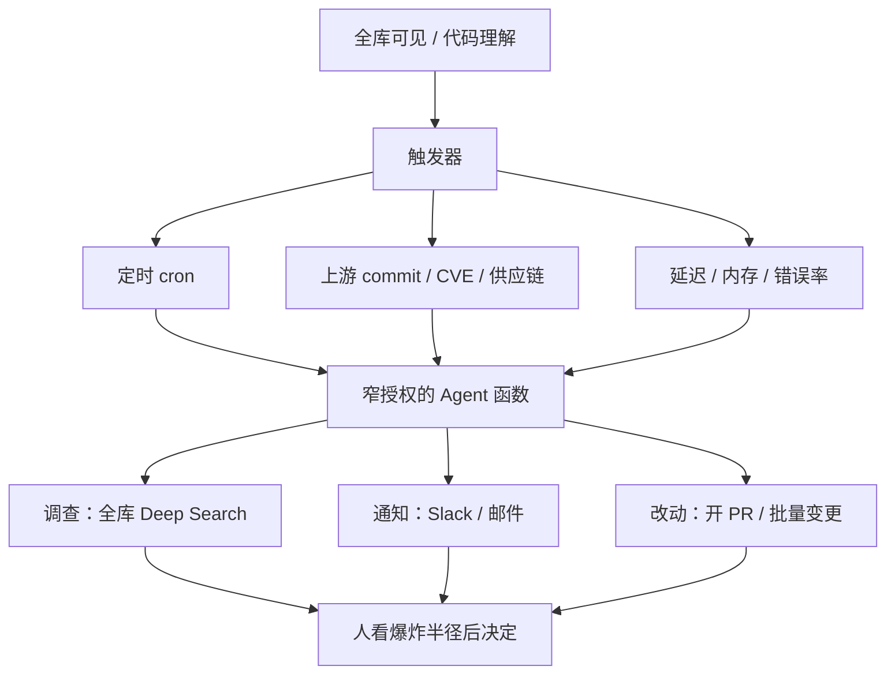

### 结论

Sourcegraph 的 Dan Adler 在 [The autonomous codebase](https://sourcegraph.com/blog/the-autonomous-codebase) 里判断：**提示词到 PR 这条管道已经磨尖了，再等下一个模型，解决不了大仓库的维护。** 行业把「一句话 / 一个 issue / 一份计划文件 → Pull Request」做到了几乎最细；套件（harness，包着模型、工具和循环的那一层）的战场已经转到云基础设施、多 Agent 编排和可扩展性。真正没解开的是 **棕地（brownfield）代码**：已经在跑、已经很大的存量仓库。需要的不是更大的输入框，而是 **触发器 + 可调用 Agent 函数** 组成的、比思想领袖画的更确定的有向图工作流——一座会自己维护的代码库。前提不变：**先看全、先理解爆炸半径。**

### 要点

- **「提示词到 PR」基本做完，不代表开发者可以收工。** Adler 说自己已经很少再 wow；新模型落地时，代码质量常常看不出差别。他拿第一代 **RAG**（Retrieval-Augmented Generation，检索增强生成）聊天助手对比：隔了几年再用来写代码，像用石头在土里划。进步很大，期望也被抬高。可一改 Sourcegraph 单体仓库里的非琐碎逻辑，他仍然会叫苦。他每周和大型企业工程负责人聊，听到的是同一件事：**维护存量代码，仍然完全没解决。**

- **这不只是上下文问题，新模型也救不了。** 他不确定瓶颈到底是上下文拿不到、窗口被撑爆、检索质量差、白费力气，还是「编程 Agent 这套范式」和仓库规模根本不匹配。生成代码的质量已经进入平台期——而且平台期的水位已经相当高——所以他敢说：**再发一个模型，也解决不了维护。** 差的是上下文、基础设施和交互模型三块一起；需要的范式看起来 **完全不像**「提示词到 PR」。

- **革命存量维护的 Agent，长得不像一个文本框。** 最简单的自主 Agent 就是定时任务（cron）。「每周一早上 8 点扫日志和可观测性（o11y）栈，有异常告诉我。」「每天晚上把 Linear 上 Q3 路线图的进度复盘发我。」1975 年的工具形状，反而比这两年任何编程 Agent 套件更改他的工作方式。你还能隐约看见「提示词到 PR」的影子，但关键一跳已经发生：**从人每次发起，变成系统自己跑。** 他不想当工程经理，不想每次有改动都再下一道指令。应许之地是 **会自己维护的代码库**。

- **原语只有两层：触发器，加上可调用的 Agent 函数。** 触发器可以是「周一 8 点」、上游仓库落地一个新 commit、公布了一条 **CVE**（Common Vulnerabilities and Exposures，公开漏洞编号）、供应链攻击被报出来、索引搜索 pod 延迟升高、客户的 Sourcegraph 实例内存耗尽、Sentry 在 commit `c321e0e` 之后错误率抬头。函数可以是一次全库 Deep Search 调查、Slack / 邮件通知人、派编程 Agent 修问题并推 PR、或在仓库里做批量改动。系统可以自主、可组合、完全 agentic，但仍然 **比许多思想领袖画的更确定**：一条有向图工作流，用专门的 Agent 去解企业仓库的问题。递归、自我修改都可以，但不是必须；你选的套件，决定你给它多长的绳子。

- **企业其实已经在想这件事，卡点是身份、授权和预算。** 每个他聊过的企业都在想 agentic **SDLC**（Software Development Life Cycle，软件开发生命周期）自动化；**A2A**（Agent-to-Agent）协议有一部分就是为这种工作流定义的。每年跑过数十亿次 GitHub Actions，很大一部分已经带了 **LLM**（大语言模型）步骤。可身份、授权、预算控制这些大问题还在。Adler 认为其中不少是我们自己造出来的，可以在套件层解决。过去四年行业在 **把套件通用化**，追求「任意人类指令都能执行」的提示词到 PR。接下来几年，企业内部会 **反向走**：更多 **范围窄、授权窄** 的 Agent，拼进触发器 / 函数工作流，安全地自动化维护。那才是自主代码库的承诺。

- **仓库里值得做的事，都从理解开始。** 企业级 Agent 落地的新潮流是「企业知识库」——卖上下文铲子的人赶上了好时候。Adler 觉得这是周期里非常正面的一步。成千上万的团队砸了山一样的力气和百万级 token 合同，把编程 Agent 铺到工程组织每个角落，有的还奖励甚至 **强制 tokenmaxxing**（拼命刷 token 用量）。结果是一波必须再审、再测、再修、再埋点，最后丢掉或上线的烂代码。销售会说 Agent 也能做这些善后。**它们做不到的是：合并前告诉你，你改的服务或库，被另一个仓库、另一套代码托管用着；或者这次 Agent 改动的爆炸半径被严重低估。** 产品能把任意提示词变成 PR，真实世界却像让它们猜你背后藏的数字。上下文——这里其实是检索——仍然是 Agent 做好事的前提。

- **没有全库可见，漂亮的工作流在两千个仓库上什么都做不对。** Agent 去查一条 CVE，如果不能在沙箱超时之前 clone 并 grep 每一个仓库，就会先窗口耗尽、再「精神错乱」，或者模型自己宣布「做得够多了，应该可以了」。企业仓库里值得做的事，都从 **全库可见和代码理解** 开始。有些事不会变：上下文为王。

### 怎么做

面向已经能用编程 Agent 开 PR，却在大仓库维护上反复踩坑的工程师：

1. **别把「等下一个模型」当成维护策略。** 生成质量进入平台期之后，再发一个模型也解不开棕地维护。把预算从「换套件、换模型」挪一部分到触发器和可见性上。

2. **先上一件最小的自主工作流，而不是再做一个更大的聊天框。** 选一件人已经在重复做、但不必每次亲手发起的事：周一扫日志和可观测性、每天复盘路线图进度。输出先做成通知，不要一上来就让它推 PR。

3. **把组织里的「该动手」列成触发器清单。** 定时、上游 commit、CVE、供应链警报、延迟/内存/错误率升高，都是触发器。写不清触发条件，就还停留在「有人想起来再问 Agent」。

4. **每个触发器只绑一个窄函数。** 调查（全库搜索）、通知人、开修复 PR、批量改动，分开授权。需要人看的先通知；需要改代码的再派编程 Agent。不要把「任意指令都能执行」当成默认权限。

5. **范围窄、授权窄。** 过去四年把套件通用化，是为了提示词到 PR；维护工作流要反过来。只给这个 Agent 读日志、或只给它在一个服务里开 PR，比给它整仓写权限更接近原文说的安全自动化。身份、授权、预算控制还没行业标准答案，先在套件层自己收紧。

6. **上自主维护之前，先解决「看不看得到」。** 两千个仓库、多代码托管的组织，没有全库搜索和依赖可见性，CVE 调查会在超时或窗口耗尽时失败。Agent 合并前问一句：这个服务/库还被哪个仓库用着？爆炸半径估没估过？答不上来就先补检索，再加触发器。

7. **不要把 token 用量当成成功指标。** 强制 tokenmaxxing 会制造必须再审、再测、再修的浪潮。度量改成：有多少维护工作是触发器自己跑完的、合并前有没有看清爆炸半径、人还要不要每次当工程经理。

### 关键图表

*Sourcegraph 原文的拆法：自主代码库是触发器 + 函数的有向图，不是更大的输入框；没有全库理解，工作流在大规模仓库上跑不对*
