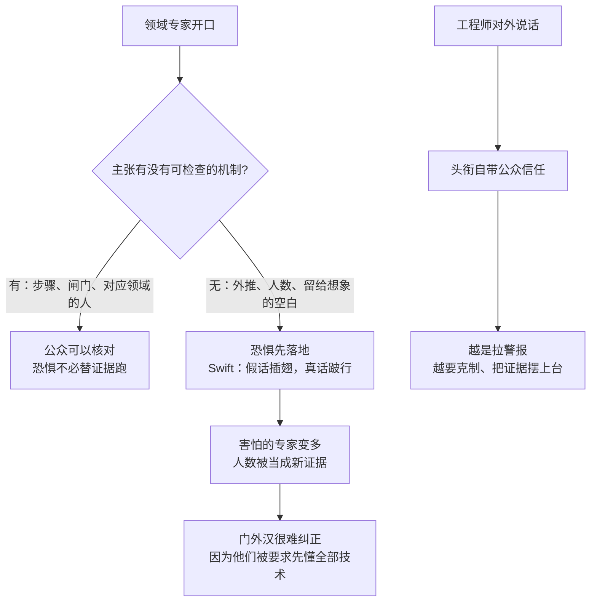

### 结论

Simon Willison 把 [Bryan Cantrill《The contagion of fear》](https://bcantrill.dtrace.org/2026/09/13/the-contagion-of-fear/) 放进链接博客：前 Anthropic 员工 Jacob Coxon 发推，确认不少 Anthropic 研究者相信 AI「能在十年内杀死我们所有人」；Cantrill 的回应不是再开一场科幻辩论，而是提醒工程师——**领域专家默认握着公众信任，吓人的说法一旦种下，比证据跑得更快**。Coxon 给出的路径是「黑关键基础设施」「灭绝级生物武器」，却没有展开机制；Cantrill 指出：他既不是基础设施专家，也不是生物武器或灭绝生物学专家。对 junior 的可用结论是：听到「很多研究员都这么想」时，先问**怎么发生、谁有资格论证那一步**，而不是把人数当成证据。

### 要点

- **这不是「AI 会不会有风险」，而是「灭世级主张要不要配证据」。** Cantrill 原文写明：Coxon 提出、Anthropic Alignment Science 负责人 Evan Hubinger 也同意，AI「杀死全人类」的概率在未来十年 **>10%**。他把这个数字翻成日常语言：若你有新生儿，等于有人主张孩子上初中前有超过一成机会死于 AI。这已经不是「可能造成伤亡」的工程风险讨论，而是他所说的、能直击家庭安全感的「阴森主张」。

- **大学机房恶作剧，是同一条传染路径。** Cantrill 坦白：大一时他们跑到隔壁人文实验室，谎称病毒从 CS 机房逃出来，让大家弹出软盘。结果是拔电源、扯线、尖叫、冲出教室——期末周有人丢了作业。他们立刻说「是恶作剧」，有人愤怒，有人已经不信澄清。设施主管让每人写两封道歉信，并警告再犯就换学校。他的类比是：技术圈对门外汉喊「着火了」，恐惧会自己扩散；**人数多、口气急，并不能补上缺失的机制**。

- **「很多专家害怕」会变成循环论证。** 公众不可能同时懂 LLM、关键基础设施、生物武器和灭绝生物学——那是 18 岁的 Cantrill 犯过的错：以为别人都该懂技术细节。真正该扛举证责任的是提出主张的人。Swift 那句「谎言插翅，真相跛行」在这里的意思是：恐惧一旦落地，后续证据很难追上；害怕的专家一多，反对声音听起来像少数派。Cantrill 说 Coxon 更像**传播者（vector）**而不是零号病人——这类灭绝叙事已经在圈内流传，他只是把它送进主流。

- **智能 ≠ 工程；数字系统进物理世界要经过人设计的闸门。** Cantrill 引用自己 2023 年 Monktoberfest 演讲 [Intelligence is not Enough](https://speakerdeck.com/bcantrill/intelligence-is-not-enough-the-humanity-of-engineering)：工程不只是「够聪明」，还要在物理世界里行动和推理。灭世叙事常一句「机器人会去做」就跳过这一步。以他造计算机的窄领域看：今天的机器人做不到这些叙事所要求的物理代理，时间表也对不上「十年灭绝」。数字系统若对现实有代理权，那是人类用胳膊、腿、大脑和问责链**允许**它有的——智能并不能豁免物理规律。

- **Simon 补了一段播客：生物武器说法把空白留给想象力。** 他指向自己做客的 Oxide and Friends 一集（[51m44s](https://oxide-and-friends.transistor.fm/episodes/the-open-weight-revolution-with-simon-willison/transcript#t=51m44s) / [57m04s](https://oxide-and-friends.transistor.fm/episodes/the-open-weight-revolution-with-simon-willison/transcript#t=57m4s)）。Cantrill 在那里说：这种说法太容易用恐惧填空；「它能给你生物武器——怎么给？能不能请生物学家、或真做过相关工作的人进来讲？」他被卡住的不是「生物风险是否存在」，而是**把机制留给听众自己脑补**。

### 怎么做

面向会写代码、也会被同事/家人追问「AI 会不会灭世」的工程师：

1. **把主张拆成机制链，而不是投票。** 听到「黑关键基础设施 / 灭绝级生物武器 / 十年内 >10%」时，逐段问：这一步由谁执行、经过哪套物理或运营闸门、失败模式是什么、主张者是否在那一领域做过工程。答不上来，就停在「未论证」，不要替对方补科幻桥段。

2. **对外说话时，把「我懂模型」和「我懂那条灭世路径」分开。** 你调过 Claude / GPT、读过 alignment 博客，不等于你能代表电网调度、生物安全或灭绝生物学发言。Cantrill 的教训是：头衔会让门外汉默认你已经核实过。越是拉警报，越要用可检查的证据，而不是「圈内很多人都怕」。

3. **用 Carl Sagan 那把尺子：超常主张配超常证据。** 灭世是技术圈能说出的最重的话。对方若只有外推、类比和「研究员共识」，你可以保持怀疑——Cantrill 写给第一次听到这些说法的人：你的不可置信是正当的。举证责任在主张方，不在公众去自学全部领域。

4. **继续处理当下能动手的风险，别用灭绝叙事替换值班表。** 提示注入、密钥进仓库、评测沙箱出网、不可信代码执行，都是已发生、可设计控制的工程问题。Cantrill 并没有说「AI 无害」；他反对的是用不完整外推去敲家庭的门。团队讨论风险时，把「现有控制系统会不会被绕过」写进设计评审，比复述概率口号更有用。

5. **读原文和播客，再决定你怎么转述。** 先打开 [Cantrill 全文](https://bcantrill.dtrace.org/2026/09/13/the-contagion-of-fear/)，再听 Simon 标注的那两段。转述给非技术同事时，带上「主张 / 机制 / 领域是否匹配」三栏，避免只转发那句「十年内杀死全人类」。

### 关键图表

*Cantrill 的主线：专家信任是易燃物；灭世级说法若跳过机制，传染的是恐惧，不是证据*
