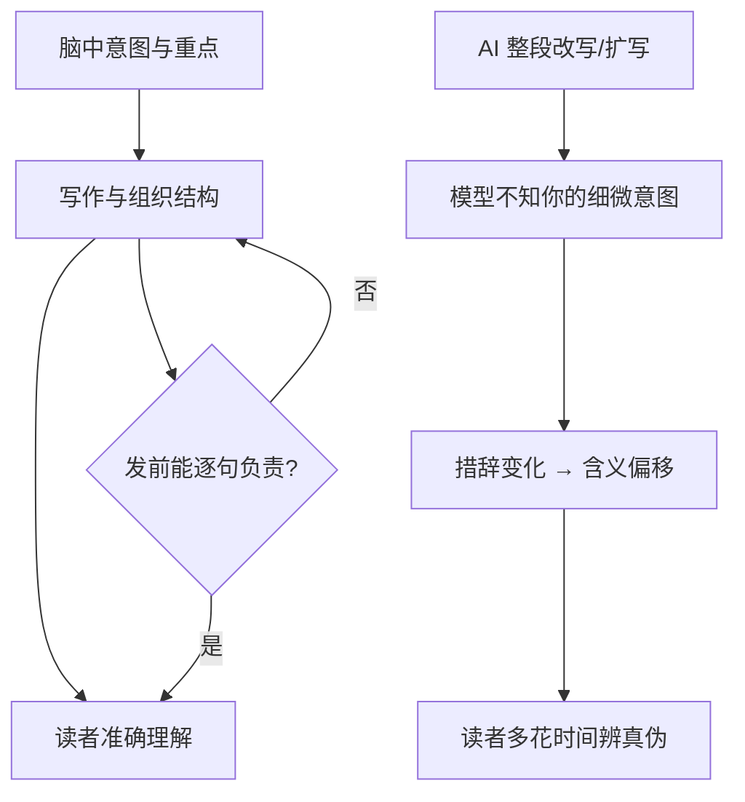

### 结论

Clay 工程师 Sophie Alpert 写了一份「工程师可接受的 AI 写作用法」内部规范，后被全公司采纳；Simon Willison 推荐其中的核心判断：**自然语言不存在无损变换**——每一次改写、润色都会微调含义，而 AI 没有你脑中那套完整意图，信息必然流失。AI 可以用来脑暴、起草、校对，但发出去之前，文档里的每个观点都必须是你真正想说的。

### 要点

- **每条句子你都要能负责。** 评审问「这句什么意思」时，不能说「哦那是 AI 写的，忽略就好」。你对外分享的内容必须代表你自己的思考；夹杂与你本意不符的句子，要么误导读者，要么暴露你没认真过稿。

- **写作就是思考。** 技术方案、项目周报、事故复盘的价值不只在文档本身，更在**决定强调什么、怎么组织结构**的过程里。把整份文档外包给 AI、自己跳过思考，往往对主题的理解反而更浅——即便 AI 帮你理过思路，也要自己完整审一遍才算数。

- **写的时间应多于读的时间。** 一篇文档通常一人写、多人读。用一句 prompt 生成长文再甩给同事，等于把阅读成本乘到全团队头上——他们完全可以自己去问 ChatGPT。多花一点时间把文档写清楚，是一次投入、全员受益。

- **更长不等于更好。** AI 擅长灌水：多写几句看似正确、实则空洞的句子。帕斯卡说过「信写得更长，是因为没时间写短」。若长文只是短 prompt 的膨胀版，不如直接分享 prompt。用 AI 只做精简编辑时灌水风险小一些，但措辞一变，原意仍可能被盖住。

- **改写必有损。** 这是标题里的技术隐喻：不像代码里的无损压缩，自然语言每次转述都会变义。读者宁愿看到带点毛边、但确实是你想法的文字，也不要 polished 却偏离本意的 AI 腔。

- **例外：可标注的 AI 原话。** 若明确标成「Claude 提了这点，值得深挖吗？」，把未打磨的模型输出当讨论素材引用，是可以的。

### 怎么做

团队里用 AI 写设计文档、RFC、复盘时，可以按下面节奏落地：

1. **先定这篇文档的读者与决策点。** 写之前用 bullet 列出「读者看完要明白什么、要做什么决定」——这是你的意图锚点，别交给模型猜。

2. **AI 用在脑暴和结构草稿，不用于终稿甩锅。** 可以让模型列提纲、挑表述，但终稿每一节你要能口头复述核心论点；答不上来的段落，删掉或重写。

3. **发前做「责任扫描」。** 通读一遍，对每段问：这是我同意的观点吗？结构是否突出了我最想强调的风险？有没有 AI 惯用的空话（「值得注意的是」「综上所述」堆叠）？有就改或删。

4. **控制篇幅：写的时间 > 读者预计阅读时间。** 若初稿是 prompt 的三倍长，先砍到一半再发；能一页说清的 spec，别扩成十页。

5. **团队约定引用规则。** 讨论阶段可以贴「模型原话 + 是否采纳」；对外或对外的正式文档里，未标注的句子一律视为作者本人立场。

6. **校对可以用 AI，定稿必须是人。** 语法、拼写可以让工具过一遍；含义、优先级、是否尊重读者时间，只能由作者签字。

### 关键图表

*写作是把想法从大脑传到别人脑子里的过程——外包给 AI 的改写环节，信息无法无损通过*
