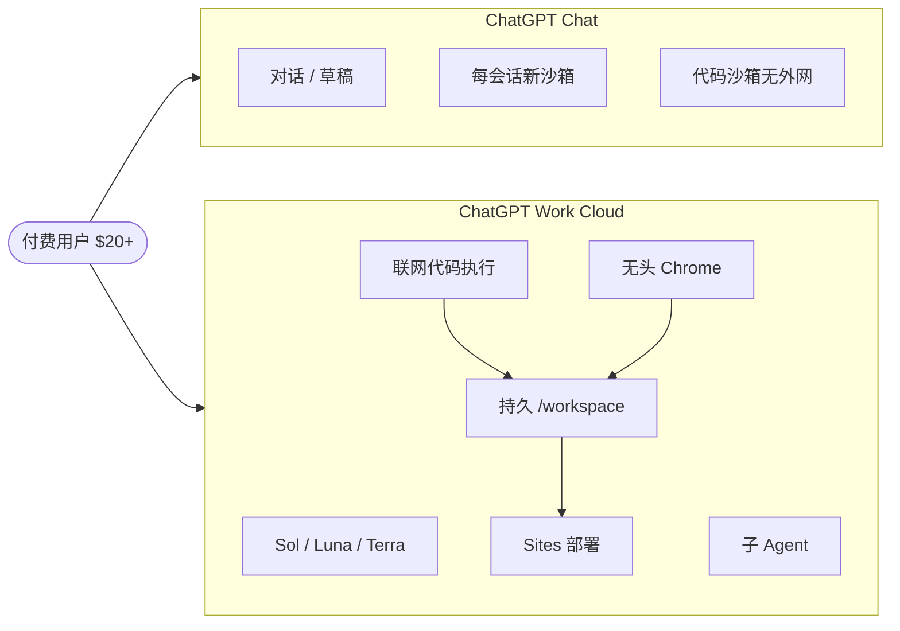

### 结论

OpenAI 的 **ChatGPT Work** 其实是两条产品线：云端版（Work Cloud，经 chatgpt.com 或手机 App）和桌面版（Work Local，旧 Codex 客户端，能直接读写本机文件）。对多数人来说，**Work Cloud 才是和「普通 Chat」拉开差距的那一侧**——它把联网代码执行、无头 Chrome、跨会话持久文件系统、子 Agent 和 ChatGPT Sites 部署捆在一起，更像一个能动手干活的云端 Agent，而不只是聊天窗口。付费档（$20/月起）才能用；免费和 Go 档没有入口。

### 要点

- **Work 和 Chat 不是「任务类型」之分，而是「能力」之分。** 官方说「要答案用 Chat、要交付物用 Work」，但很多人早就在 Chat 里写简报、做分析了。真正该问的是：Work 多了哪些 Chat 没有的东西？

- **模型选择不同，额度也可能分开算。** Work 可选 GPT-5.6 的 Sol / Luna / Terra，并带 Light 到 Ultra 多档推理强度；Chat 则是 Instant / Medium / High 等命名，$20 档最高到 High，Pro 要 $100+。Work 会话可能走 **Codex 额度**，Chat 有独立额度——同一订阅下两边模型和用量未必互通。

- **联网代码执行是 Work Cloud 的杀手锏。** 类似 2023 年 Code Interpreter，但容器现在能访问外网：克隆 GitHub、装依赖、调 API。普通 Chat 的沙箱会拦外部网络；Claude 容器虽能装 PyPI/NPM 包，域名白名单很短。Work 默认可配域名白名单，默认接近全网开放——实用，也意味着要自己评估风险。

- **无头 Chrome 能登录、填表、跑 DOM 脚本。** 需要账号时浏览器会请你接管输入密码和 2FA，凭证不经过模型。作者让 Work 打开 simonwillison.net 并用 Playwright 式 API 提取标题，在手机上就能完成——相当于把 shot-scraper 类能力搬进对话。

- **文件系统跨会话持久，多任务可共享卷。** Chat 每个会话是全新沙箱；Work 每个会话有独立 scratch 目录（如 `/workspace/scratch/e00a0a017944`），但会保留，下次还能读。正在运行的多个 Work 会话似乎挂载同一 `/workspace` 卷，改文件彼此可见，但进程和 localhost 服务不共享。

- **ChatGPT Sites 一键部署到 Cloudflare Workers。** 可含 HTML/JS 和服务端逻辑（D1、R2）。默认私有，可公开或（团队版）指定分享对象。定时任务可每小时更新站点——这是 Chat 做不到的闭环。

- **子 Agent 与定时任务偏进阶。** Work 能并行跑 Sol/Luna/Terra 子会话；也可设「每天 8 点搜某新闻，有更新再通知」。定时能力 Chat 也有，但和 Sites、联网执行组合时价值更大。

- **安全上要警惕「致命三连」。** 私有数据 + 不可信网页内容 + 外发通道同时存在时，提示注入风险很高。OpenAI 多半沿用 Codex 的 auto-review，但公开说明不多——用 Work 处理敏感数据前要心里有数。

### 怎么做

1. **先确认你有 Work Cloud 入口。** 需要 $20/月及以上订阅；桌面「Work Local」是另一条路（本机文件 + 程序），本文聚焦云端版。

2. **用「缺什么能力」选 Chat 还是 Work。**
   - 只要文字回答、头脑风暴、短稿 → Chat 通常够用。
   - 要克隆仓库、装包、调外部 API → Work。
   - 要登录网站、抓页面、填表 → Work 的无头浏览器。
   - 要跨几天继续改同一份文件或部署可访问的站点 → Work。

3. **联网执行：写清目标与边界。** 提示里说明仓库地址、要装的依赖、允许访问的域名；默认可全网时，避免让 Agent 随意打开不明链接或上传内部文件。

4. **浏览器任务：准备好人工登录。** 遇到 2FA 时按提示接管浏览器；不要让模型代填密码。

5. **持久文件：给 scratch 目录起有意义的名字或备注。** 会话多了会有上百个文件夹，重要产物及时下载或推到 ChatGPT Site，别只靠云端路径记忆。

6. **复杂项目再开子 Agent。** 能单线程完成就别并行——子 Agent 更快也更耗额度。

7. **想摸清工具有哪些？** 作者让 Work 自建了一个列出 223 个工具、44 个 Skill 的文档站；其中 `control-browser`、`sites-building`、`data-analytics` 等 Skill 说明了浏览器、建站、表格等能力边界，比官方「用途描述」更具体。

### 关键图表

*Work Cloud 在 Chat 的对话能力之上，叠加可执行、可浏览、可持久、可部署的 Agent 栈；选哪边取决于你是否需要这些「动手」能力，而非任务名称。*
