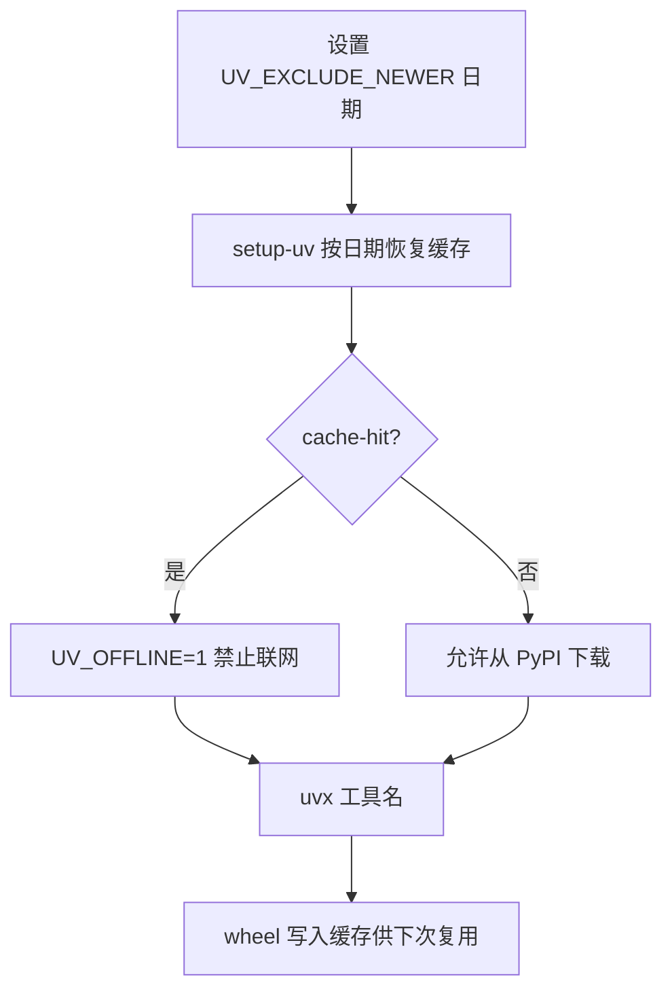

### 结论

在 GitHub Actions 里随手写 `uvx 工具名` 很方便，但默认每次跑 workflow 都可能去 PyPI 拉包。Simon Willison 的做法是：**用 `UV_EXCLUDE_NEWER` 把工具版本钉在某一日期，并把该日期写进缓存键**；首次运行下载，之后从 Actions 缓存离线复用，需要升级时只改这一个日期。

### 要点

- **`uvx` 是什么。** 来自 Astral 的 `uv` 生态，类似 Node 的 `npx`：不用先写 `requirements.txt`，一行命令就能临时跑 Python CLI 工具（如 `uvx sqlite-utils`）。适合 CI 里偶尔调用小工具，但裸用容易每次都联网装依赖。

- **痛点不在「有没有缓存」，而在「缓存键怎么定」。** 常见做法是用 `pyproject.toml` / `requirements.txt` 的哈希当 GitHub Actions 缓存键——对小脚本来说，为了缓存多维护一份依赖文件不划算。

- **`UV_EXCLUDE_NEWER` 一石二鸟。** 等价于 `uvx --exclude-newer 日期`：只安装该日期之前发布的最新版。同一个日期 + 同一组 `uvx` 命令，解析结果可重复；把日期放进 `cache-suffix`，缓存键也稳定。

- **`setup-uv` 要关掉默认剪枝。** Astral 官方 `setup-uv` 默认 `prune-cache: true`，上传前会删掉预编译 wheel——对「想持久复用下载物」的场景正好相反，必须设 `prune-cache: false`。

- **缓存命中后设 `UV_OFFLINE=1` 防静默联网。** 命中缓存时写入该环境变量，`uvx` 若发现工具未装过会直接失败，而不是悄悄再去 PyPI。新增工具却忘了改日期，能立刻暴露问题。

### 怎么做

1. **在 workflow 顶层设日期环境变量**（需要升级工具或刷新缓存时只改这里）：

```yaml
env:
  UV_EXCLUDE_NEWER: "2026-07-12"
```

2. **用 `astral-sh/setup-uv` 恢复缓存**，关键参数如下：

```yaml
- name: Install uv and restore cache
  id: setup-uv
  uses: astral-sh/setup-uv@v8
  with:
    enable-cache: true
    cache-dependency-glob: ""   # 不依赖 pyproject.toml 等文件
    cache-suffix: "tools-${{ env.UV_EXCLUDE_NEWER }}"
    prune-cache: false          # 保留 wheel，别被默认剪枝
```

3. **缓存命中时强制离线**：

```yaml
- name: Require cache-only uv on cache hits
  if: steps.setup-uv.outputs.cache-hit == 'true'
  run: echo "UV_OFFLINE=1" >> "$GITHUB_ENV"
```

4. **之后任意步骤里直接 `uvx`**，例如 `uvx sqlite-utils --version`、`uvx llm --version`。首次运行（或日期 bump 后）会下载；后续命中缓存则走本地。

5. **运维习惯：** 往 workflow 加新 `uvx` 工具时，把 `UV_EXCLUDE_NEWER` 往后拨一天（或改 `cache-suffix`），否则离线模式下可能报「工具未安装」。作者也提醒：这与 uv 官方「CI 里不必持久化 wheel、每次重下更快」的建议相反——他宁愿略慢一点也不想每次打 PyPI CDN。

### 关键图表



*一个日期变量同时锁定版本解析与缓存键——升级工具时只 bump 日期*
