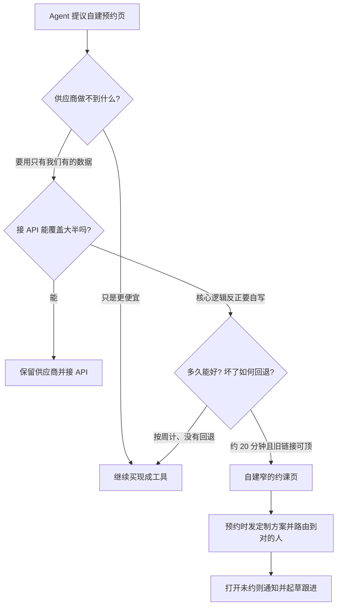

### 结论

SaaStr 创始人 **Jason Lemkin** 写了一件三人小团队的真实决定：Calendly 便宜、好用、他们用了很多年，按理不该自建预约工具。营销同事 Amelia 和内部 AI 营销/收入副总裁 **10K**（跑在 [Replit](https://replit.com/) 上、能写 Salesforce、管广告和报价到回款、接了约 30 套系统）重建赞助商获客漏斗时，10K 建议停用 Calendly、自己做约课页，并说自己能写。Agent 在 Replit 上大约 **20 分钟** 做完，现在挂在赞助销售漏斗的最后一环。Lemkin 的判断不是「AI 让自研变便宜，所以什么都该造」，而是：**预约本身可以继续租；谁来见、见面时看到什么，取决于只有他们自己有的数据。**

### 要点

- **Agent 想造东西，本身不是开工理由。** 10K 喜欢动手。每条建议都照做，团队会留下一堆不必维护的自研工具。他们先逼它讲清「为什么」，第一条理由（我想做）不够；第二条才够：新预约页能做 Calendly 做不到的事。

- **真正缺的不是日历，是漏斗里那一格看不见。** 以前 David 发自己的 Calendly 链接，Amelia 发自己的会议链接，两套工具都不接公司其他系统。赞助意向客户预约时，现在同时拿到两样东西：一份**实时定制方案书**（带公司名、来过 SaaStr AI Annual 的竞争对手、Agent 推荐的套餐；同一条链接会随他们对新客户的了解更新）；以及约到**对的人**。路由看的是谁已经在跟哪些赞助商——Base44 进来时分给 Amelia 而不是 David，因为 Amelia 名下 Replit、Lovable 的量更大，Agent 按这个权重，而不是按 David 名下有 Vercel。

- **自建比「留着 Calendly 再外接」更省事，因为核心逻辑反正要自己写。** 他们可以走 Calendly API。10K 的看法是：路由、方案书投递、打开后未预约的追踪，都依赖 Salesforce 和 10K 自己的数据；Calendly 不知道谁拥有哪个赞助账户、方案书里写了什么、热力图显示客户读了哪一段。外接等于自写大部分逻辑，再多养一层集成。做完之前，日历是漏斗里唯一看不见客户做了什么的一步；做完就能看见。有人打开约课页又离开，10K 会通知 Amelia，并起草跟进邮件。

- **20 分钟和「坏了还能回退」把门槛压得很低；两周就会继续买。** Amelia 第一反应是「这不就是个日历」。单独一个日历不值得造。成立的是它接上的东西：客户点预约时，系统已经知道对方是谁、读过什么、该谁接。Agent 估两周，他们会留下 Calendly。同类判断也出现在 Zapier：它曾悄悄丢掉大约 **20%** 尚未进 Salesforce 的报名。他们留下 Zapier 里难重建、也没出问题的登录触发，只把丢单的动作步骤搬进自己的代码。

- **默认仍然是买。Agent 的采购决定要复核，敏感流程先问再做。** Salesforce、Qualified、Clay、ZoomInfo、Artisan、Monaco、Gamma、Clarity 都是买的。10K 选热力图工具时没货比三家就定了 Microsoft Clarity；也曾在 12 小时内，按价格否掉自己短名单里的供应商。决定常常对，他们仍要检查。一年前 10K 还在提门票推荐计划；现在更大的产出是产品建议——入站定制方案书是它先想到的（续约侧已经有大半零件），约课页也是。它眼下还想给后端权限较少的销售同事 David 做一版自己。

### 怎么做

面向正在让 Agent 参与「买还是造」的 junior 和三人小组：不必复制 10K 这个名字，按同一组问题挡一遍。

1. **先让 Agent 回答「供应商做不到什么」。** 如果只是更便宜、功能差不多，继续买。不要因为 Agent 想写代码就开一个仓库。

2. **再问「接 API 是否覆盖大半」。** 能接就接。只有当你自己的客户归属、方案书、行为数据构成预约体验的主体，而供应商根本没有这些字段时，才进入自建。

3. **用时间和回退压风险。** 问清楚要多久、坏了怎么办。大约 20 分钟、旧 Calendly 链接还能顶上，才是容易说 yes 的组合。估到按周计，默认留下现成工具。

4. **只造窄的那一块。** 日历、触发器、已经稳定的中间件继续租。把「谁该见、见面看到什么、没约成怎么跟」这类只有你有数据的步骤，写成自己能改的代码。

5. **敏感流程先听计划再放行。** SaaStr 在这次也要求 Agent 先说明要做什么。上线后抽几条真实预约：路由对不对、方案书是否带对公司名、打开未约是否真的进了跟进队列。

### 关键图表

*SaaStr 原文的决策链：不是 Agent 想造就造，而是独家数据 + 短工期 + 可回退，才替换漏斗里那一格看不见的日历*
